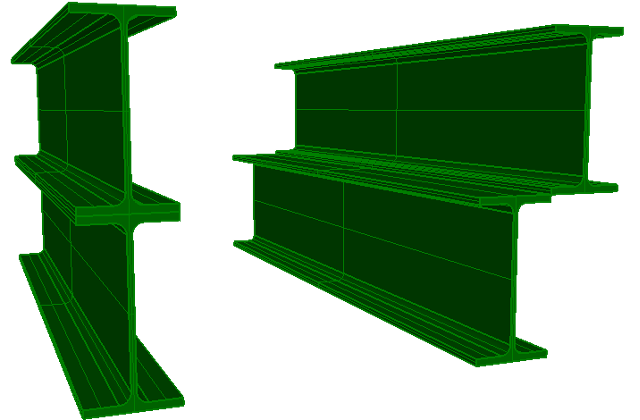
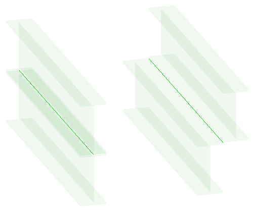

This example illustrates four standard case beams, all with an extruded area solid and axis representation. They have different cardinal points to align the I-Shape profiles with the beam axis. Figure 1 shows the beam solids, Figure 2 shows the beam axes.

<table summary="extrusion representation">
 <tr>
  <td>
  </td>
  <td>
  </td>
 </tr>
 <tr style="height:20px;">
  <td style="vertical-align:bottom;">
   
Figure 1 &mdash; Standard case beams with cardinal points.

  </td>
  <td style="vertical-align:bottom;">
   
Figure 2 &mdash; Standard case beams with transparent solids showing the axes.

  </td>
 </tr>
</table>

> NOTE&nbsp; There is no color information within the file, the displayed color and the transparency has been set by the target application as a default.
