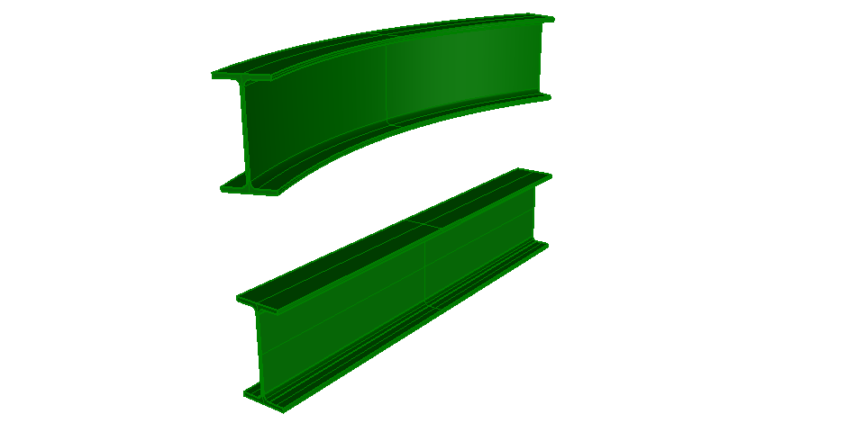

This example illustrates two standard case beams, one with an extruded area solid, the other with a revolved area solid. Figure 1 shows the resulting shape.

> NOTE&nbsp; There is no color information within the file, the displayed color has been set by the target application as a default.
