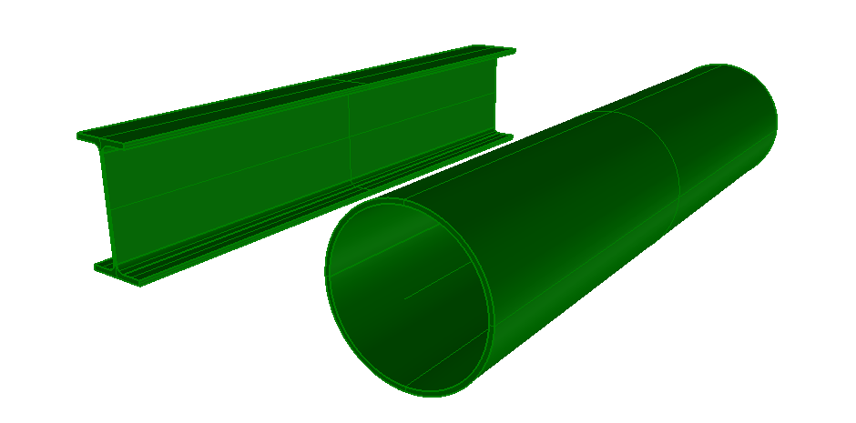

This example illustrates two standard case beams with two different profiles, one I-Shape and one Hollow-Circle profile. Figure 1 shows the resulting shape.

> NOTE&nbsp; There is no color information within the file, the displayed color has been set by the target application as a default.
