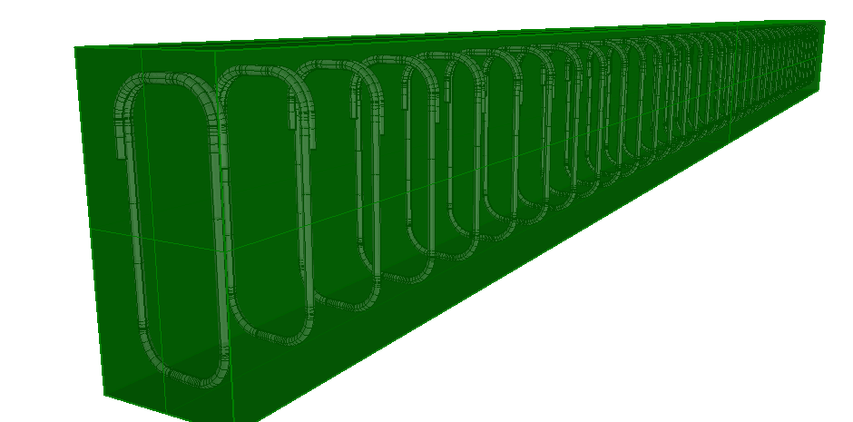

This example illustrates a beam with an assembly of reinforcing stirrups, the geometry of the stirrups is defined by mapped items linking to a mapped representation being a swept disk solid along a directrix. Figure 1 shows the resulting shape.

> NOTE&nbsp; The directrix is defined by _IfcIndexedPolyCurve_

> NOTE&nbsp; There is no color information within the file, the displayed color has been set by the target application as a default.
