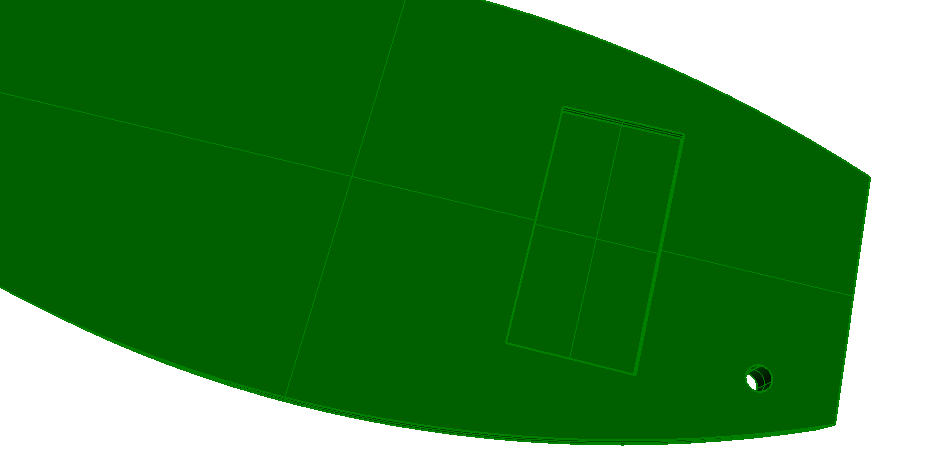

This example illustrates a standard case slab with extruded solid geometry, based on a material layer set usage definition. It includes one round opening and one rectangular recess. Figure 1 shows the resulting shape.

> NOTE&nbsp; The opening and recess are instances of _IfcOpeningStandardcase_.

> NOTE&nbsp; There is no color information within the file, the displayed color has been set by the target application as a default.
