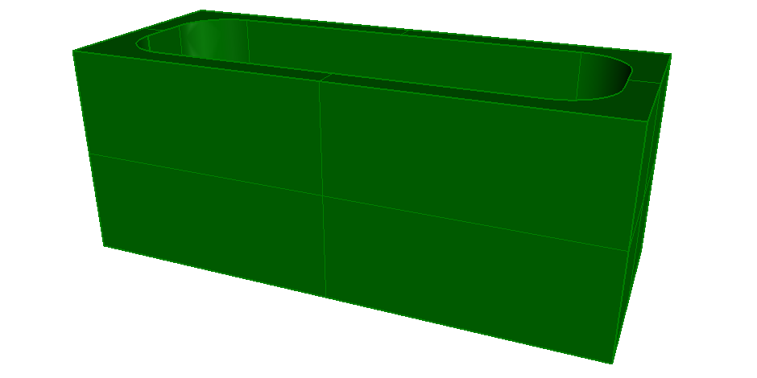

The CSG representation using Boolean operations is shown in Figure 1. It shows a bath as a santitary terminal.

> NOTE&nbsp; There is no color information within the file, the displayed color has been set by the target application as a default.
