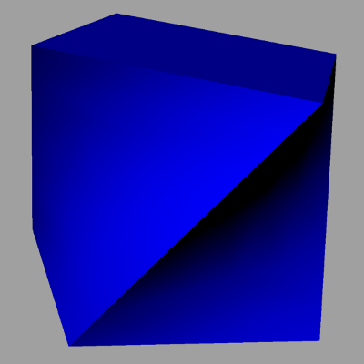
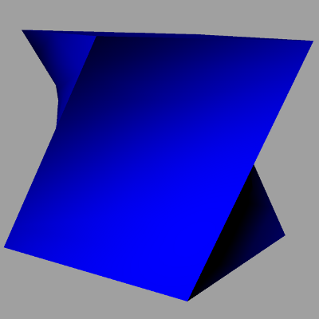
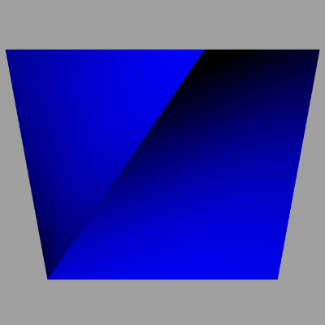
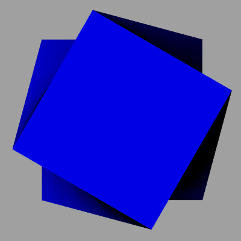

The advanced brep representation using NURBS is shown in Figure 1. It shows a twisted cube resulting in b-spline surfaces at four sides. The cube itself is exported as a proxy element.

&nbsp;

<table summary="advanced Brep">
 <tr>
  <td>
   
  </td>
  <td>
   
  </td>
 </tr>
 <tr>
  <td>
   
  </td>
  <td>
   
  </td>
 </tr>
 <tr style="height:20px;">
  <td colspan="2" style=" vertical-align:bottom;">
   
Figure 1 &mdash; Advanced shape represented as advanced Brep

  </td>
  <td>&nbsp;
  </td>
 </tr>
</table>

> NOTE&nbsp; There is no color information within the file, the displayed color has been set by the target application as a default.
