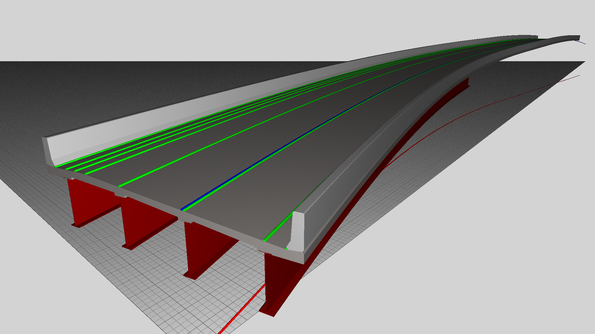

This example demonstrates a bridge with swept geometry related to alignment curves.

An alignment curve is defined with circular curvature horizontally and parabolic curvature vertically. Eight string lines are defined relative to this alignment curve using _IfcOffsetCurveByDistances_.

The bridge girders are defined by _IfcElementAssembly_ having PredefinedType set to GIRDER, and decomposed into _IfcBeam_ elements for each segment, with geometry defined by _IfcSectionedSolidHorizontal_ having a constant cross-section.

The bridge deck is defined by _IfcElementAssembly_ having PredefinedType set to SLAB_FIELD, and decomposed into _IfcSlab_ elements for each continuous concrete section (separated by construction joint), with geometry defined by _IfcSectionedSolidHorizontal_ consisting of variable cross sections, where _IfcArbitraryClosedProfileDef_ defines each cross section.

