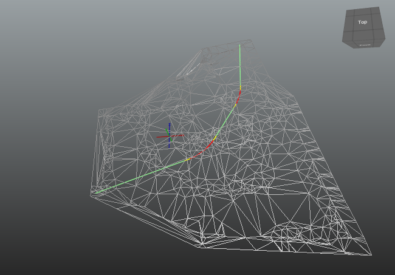

This example demonstrates terrain modeling. Two separate terrains are defined as a triangulated surface model.

Supporting files are provided for verification:

* [Excel table](../../../../figures/examples/ex-terrain-surface.xlsx)
