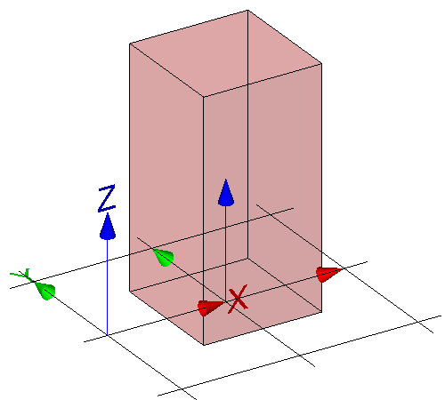

The examples demonstrate the use of various geometric shape representation types to express a simple geometric form of a building element proxy. All example files uses the same basic structure of the data set and only differ in the geometric representation items used to define the same shape (a block of 1m x 1m x 2m).

The basic structure provided with the sample IFC files include:

* the basic context of the data set provided by _IfcProject_ and referenced entities: 
    *  _IfcOwnerHistory_ for user, application and time stamp where the project data set had been created; 
    *  IfcGeometricRepresentationContext for the general context, including representation type, dimension, coordinate system, and precision; 
    *  IfcUnitAssignment for the default units used within the data set, 
* the basic spatial structure of the project provided by a single _IfcBuilding_ with referenced entities: 
    *  _IfcLocalPlacement_ to create the local object coordinate system of the building being the parant coordinate system for all objects contained within the building; 
    *  _IfcRelAggregates_ to link the _IfcBuilding_ to the _IfcProject_ as the uppermost item of the project spatial structure, 
* the proxy element having a shape representation provided by a single _IfcBuildingElementProxy_ with referenced entities: 
    *  _IfcLocalPlacement_ to create the local object coordinate system of the proxy relative to the object coordinate system of the building; 
    *  _IfcProductDefinitionShape_ to define the geometry within the local object coordinate system. 

<table summary="basic shape">
  <tr>
    <td></td>
    <td style="vertical-align:bottom;">
  <blockquote class="example">
  EXAMPLE&nbsp; The geometry of the proxy is a 3D block with length=1m, width=1m and height=2m. It is positioned with a local coordinate system at 10m,0m,0m from the coordinate origin of the parent coordinate system of the building. The local object coordinate system has no rotation. 
   
  See Figure 1 for the geometric shape of the example.
  </blockquote>
  </td>
 </tr>
 <tr style="height:20px;">
  <td>
  

  Figure 1 &mdash; Basic shape of the proxy being a block.
  

 </td>
 <td>
  &nbsp;
 </td>
</tr>
</table>

The same block geometry can be expressed using different 3D models. The example IFC files introduce the swept solid model, surface model, boundary representation model, constructive solid geometry model and the tesselated surface model.

> NOTE&nbsp; Depending on the model view definition some representation types may not be allowed in actual exchange scenarios.
