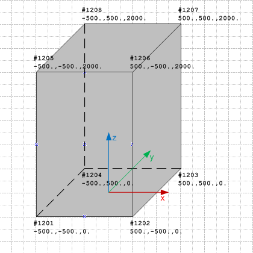

The block geometry can be expressed using the boundary representation geometry model, expressing it as a faceted boundary representation.

<table summary="b-rep types">
 <tr>
  <td>
   
  </td>
  <td style=" vertical-align:bottom;">
   <blockquote>
    Figure 1 shows the block geometry represented by a faceted boundary representation.
   </blockquote>
  </td>
 </tr>
 <tr style="height:20px;">
  <td style=" vertical-align:bottom;">
   
Figure 1 &mdash; Basic shape represented as brep model

  </td>
  <td>&nbsp;
  </td>
 </tr>
</table>
