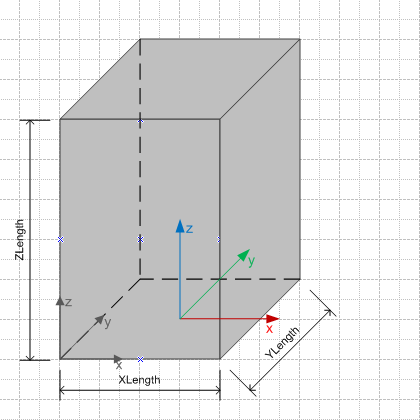

The block geometry can be expressed using the constructive solid geometry model, expressing it as a CSG primitive.

<table summary="CSG type">
 <tr>
  <td>
   
  </td>
  <td style=" vertical-align:bottom;">
   <blockquote>Figure 1 shows the block geometry represented by an CSG primitive.
   </blockquote>
  </td>
 </tr>
 <tr style="height:20px;">
  <td style=" vertical-align:bottom;">
   
Figure 1 &mdash; Basic shape represented as CSG primitive

  </td>
  <td>&nbsp;
  </td>
 </tr>
</table>
