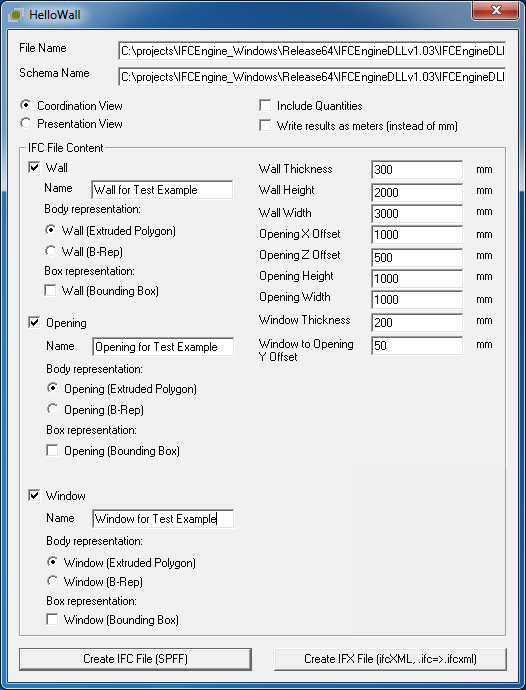
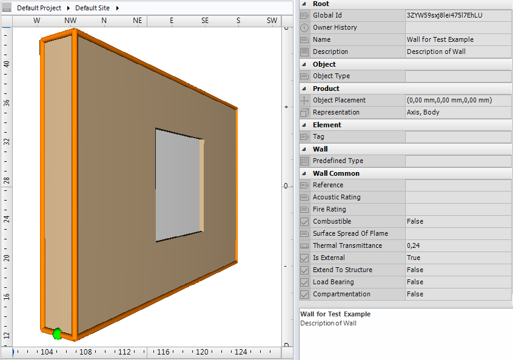

The example demonstrates how a window can be placed inside a wall. The basic format of the wall is 3 meter length and 2 meter height with a thickness of 300 mm. The window has a size of 1x1 meter and is placed exactly in the middle of the wall.

To insert a window or door in a wall it is required to create an opening. The following entities are relevant:

*  _IfcWall_ (or _IfcWallStandardCase_ if geometry representation allows for it); 
*  _IfcOpeningElement_; 
*  _IfcWindow_. 

The three entity instances have to be connected in 2 different ways

* via relative placement; 
* via topological connection. 

Each physical object has a placement. The placement is represented by _IfcLocalPlacement_ and can be relative to an _IfcLocalPlacement_ of another physical object (in case of aggregation, feature or filling relation) or of an spatial structure element. This process of local placements is recursive. _IfcWall_, _IfcOpeningElement_ and _IfcWindow_ each have their own _IfcLocalPlacement_, however the _IfcLocalPlacement_ of _IfcWindow_ is defined relatively to the _IfcLocalPlacement_ of _IfcOpeningElement_ and the _IfcLocalPlacement_ of _IfcOpeningElement_ is defined relatively to the _IfcLocalPlacement_ of _IfcWall_.

The _IfcWall_ and _IfcOpeningElement_ are connected via the objectified relation _IfcRelVoidsElement_. The _IfcRelVoidsElement_ is connected with the wall via the relationship RelatingBuildingElement and to the opening element via the relationship RelatedOpeningElement. Through the inverse relationships it is possible to traverse from wall to opening element and vice versa.

The _IfcOpeningElement_ and _IfcWindow_ are connected via the objectified relation _IfcRelFillsElement_. The _IfcRelFillsElement_ is connected with the opening element via the relationship RelatingOpeningElement and to the window via the relationship RelatedBuildingElement. Through the inverse relationships it is possible to traverse from opening element to window and vice versa.

&nbsp;

<table summary="wall example">
        <tr>
          <td>
            
          </td>
          <td style=" vertical-align:bottom;">
            

              The Figure 1 shows the parameters used for creating the example data set.
            

          </td>
        </tr>
        <tr>
          <td>
            
Figure 1 &mdash; Parameters of wall, opening and window

          </td>
          <td>
            &nbsp;
          </td>
        </tr>
    </table>

<table summary="wall example">
        <tr>
          <td>
            
          </td>
          <td style=" vertical-align:bottom;">
            
Figure 2 shows the geometric representation of the example data set.

          </td>
        </tr>
        <tr>
          <td>
            
Figure 2 &mdash; Geometric representation of wall, opening and window

          </td>
          <td>
            &nbsp;
          </td>
        </tr>			
      </table>
