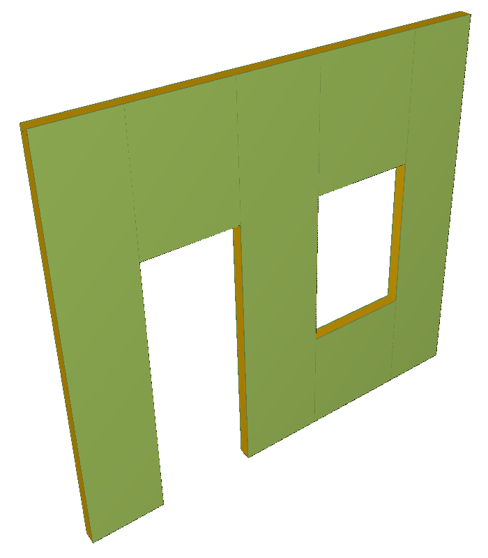
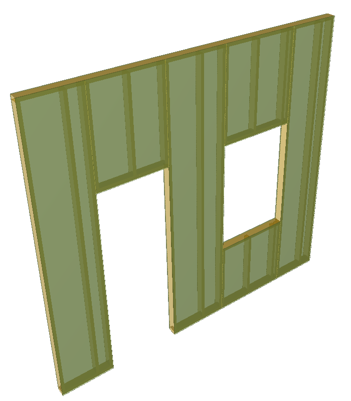

This example illustrates a framed wall with openings suitable for a door and window.

> NOTE&nbsp; The example wall is very typical of residential construction in the U.S., consisting of "2x4" framing with gypsum panels on each side.

The wall has three layers: forward-facing drywall, framing, and rear-facing drywall. Each of these layers are modeled as _IfcMaterialLayer_ and have corresponding parts which elaborate each into elements. Geometry for items makes use of _IfcMappedItem_ for efficiency in storage and processing, such that a mesh for each shape need only be instantiated once, and then transformed multiple times.

* The 'Axis' representation of the wall indicates the parametric path for which the component geometry is generated.
* The 'Body' representations of the components is derived from the defined types, the axis path, and the order of the layer as defined by the material layer set.
* The 'Surface' representation of the wall is derived from the boundaries of the component geometry.

> NOTE&nbsp; The particular rules defining layout of components of framed walls are out of scope of this specification.

The example in Figure 1 shows the solid representation of the elemented wall, the example in Figure 2 shows the same elemented wall in transparent mode.

<table summary="elemented wall">
 <tr>
  <td style="width:400px">
  </td>
  <td style="width:400px">
  </td>
 </tr>
 <tr style="height:20px;">
  <td style="vertical-align:bottom;">
   
Figure 1 &mdash; Elemented wall solid representation

  </td>
  <td style="vertical-align:bottom;">
   
Figure 2 &mdash; Elemented wall transparent representation to show inner structure

  </td>
 </tr>
</table>
