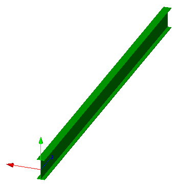

This example illustrates a standard-case beam with extruded solid geometry, based on an parametric I-Shape profile and corresponding material profile set usage definition. Figure 1 shows the resulting shape.

> NOTE&nbsp; There is no color information within the file, the displayed color has been set by the target application as a default.
