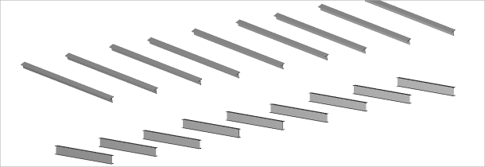
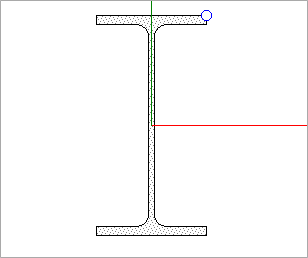
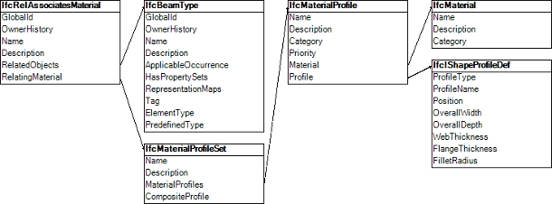
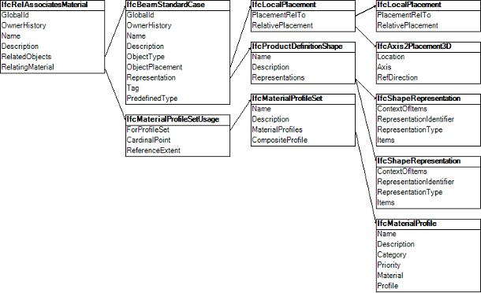

The _IfcBeamStandardCase_ is a standard case element to exchange parametric definitions of the beam shape.

The example includes the local placement, the body shape representation, the material profile set assignment, the beam occurrence and beam type definitions. The focus points are the use of cardinal points to align the beam profile to the axis, the use of parametric profile definitions and the assignment of material information to the profile.

&nbsp;

<table summary="beam example">
 <tr>
  <td>
   
  </td>
  <td style=" vertical-align:bottom;">
   
The example in Figure 1 declares two parametric beam types, one with an I-Shape
              profile and the other with a T-Shape profile. Each type has nine occurrences, using various cardinal
              points to align the profiles.
            

          </td>
        </tr>
        <tr>
          <td>
            
Figure 1 &mdash; Beam occurrences

            
&nbsp;

          </td>
          <td>
            &nbsp;
          </td>
        </tr>
        <tr>
          <td>
            
          </td>
          <td style=" vertical-align:bottom;">
            

              The beam 'A-9' in Figure 2 is an occurrence of the 'IPE220' type having an
              I-Shape profile, placed along an axis using the upper-right cardinal point.
            

            

              The cardinal point of the beam 'A-9' is set to the upper-right, indicating that the 'Body' representation
              should be generated with the upper-right of the profile aligned along the curve of the 'Axis
              representation.
            

          </td>
        </tr>
        <tr>
          <td>
            
Figure 2 &mdash; Beam profile and cardinal point usage

          </td>
          <td>
            &nbsp;
          </td>
        </tr>
      </table>

&nbsp;

<table summary="beam example" cellpadding="2">
        <tr>
          <td>
            
          </td>
          <td style=" vertical-align:bottom;">
            
The 'IPE220' beam type in Figure 3 is represented by <i>IfcBeamType</i>. As a
              parametric definition, this beam type does not have any geometric representation, rather it has a
              material profile set association indicating a cross-section which may be applied to paths defined at
              occurrences.

          </td>
        </tr>
        <tr>
          <td>
            
Figure 3 &mdash; Beam type graph

            
&nbsp;

          </td>
          <td>&nbsp;</td>
        </tr>
      </table>

<table summary="beam example" cellpadding="2">
        <tr>
          <td>
            
          </td>
          <td style=" vertical-align:bottom;">
            
Each beam occurrence as in Figure 4 is represented by
              <i>IfcBeamStandardCase</i>. The <i>IfcMaterialProfileSetUsage</i> entity indicates the alignment of the
              material profile set according to cardinal point. The <i>IfcMaterialProfileSet</i> indicates a single
              material profile. The <i>IfcMaterialProfile</i> indicates an I-Shape cross-section of steel. The
              <i>IfcIShapeProfileDef</i> indicates shape parameters of the I-Shape profile. The <i>IfcMaterial</i>
              indicates the steel material, which could be further elaborated with structural properties, surface
              styles, and fill area styles.

          </td>
        </tr>
        <tr>
          <td>
            
Figure 4 &mdash; Beam occurrence graph

          </td>
          <td>&nbsp;</td>
        </tr>
      </table>
