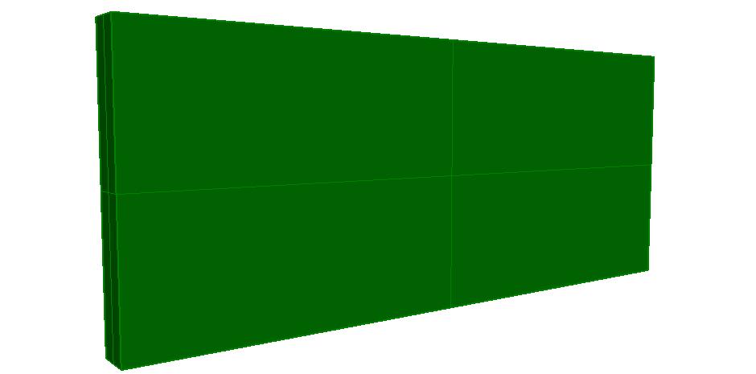

This example illustrates a standard-case wall with extruded solid geometry, based on a material layer set usage definition. Figure 1 shows the resulting shape.

> NOTE&nbsp; The extruded profile is defined by _IfcRectangleProfileDef_

> NOTE&nbsp; There is no color information within the file, the displayed color has been set by the target application as a default.
