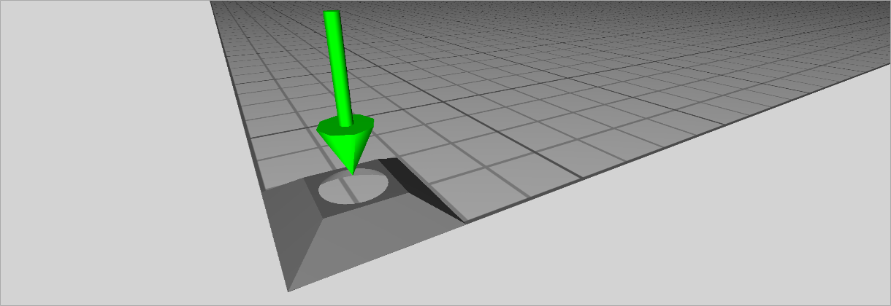
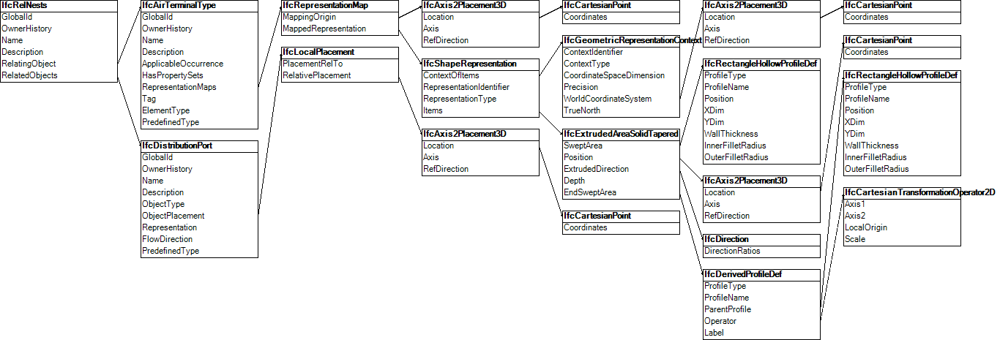

This example includes a library file containing an air terminal type. It explains how type definitions can be included from an external library.

The air terminal type consists of a single port, with property sets defined on the type and port. Figure 1 illustrates the air terminal type, where a green arrow indicates the port, placed at the arrow head.

> NOTE&nbsp; The arrow head is not part of the exchange, only the port definition. Viewers may represent ports in different ways.

The property sets have backing templates from an external library file.

{ .note}
> Standard property sets (defined within this specification) do not require templates to be included; they are shown in this example for illustration, such as if custom property sets were to be used.

The type has a nested port, as illustrated in Figure 2.

