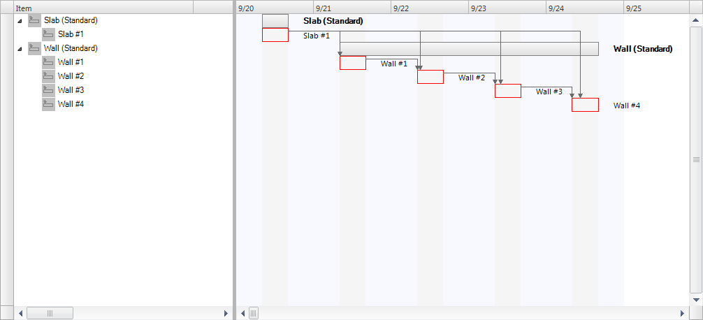
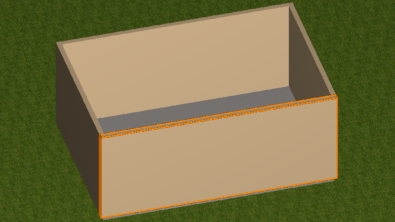
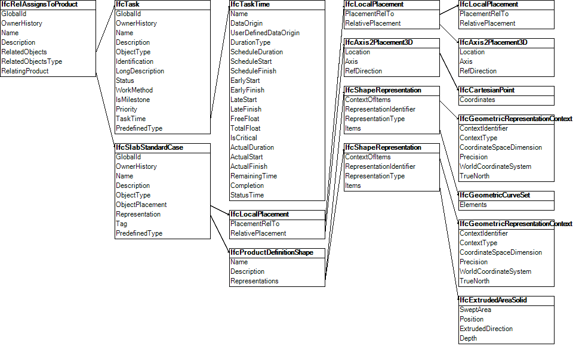

The focus point of this example is linking building elements to the task of a construction schedule to enable construction scheduling.

The example includes a hierarchy of tasks assigned to building elements. One task is assigned to pour a concrete slab, and four tasks are assigned to construct respective walls. The tasks are sequenced, where the walls are constructed in serial, following completion of the slab. The walls are nested into summary tasks for the slab and walls.

The slabs and walls in the example have a local placement, a body shape representation, and a material assignment.

Figure 1 shows a GANTT chart representing the tasks of the construction schedule.

&nbsp;

The project consists of a site aggregating a building which aggregates a building storey. The building storey contains a slab and four walls, each physically connected using _IfcRelConnectsElements_ where the _RelatingElement_ anchors the _RelatedElement_. The slab and walls have standard shape that is expressed parametrically using _ifcMaterialLayerSetUsage_ and _IfcExtrudedAreaSolid_ geometry. Therefore the slab and the walls are expressed as _IfcSlabStandardCase_ and _IfcWallStandardCase_. See Figure E26 for the geometric representation of the construction elements assigned to the tasks of the construction schedule.

&nbsp;

Each task is assigned to a resulting product produced by the task using the _IfcRelAssignsToProduct_ relationship. The root task and the construction tasks form a hierachical task - subtask relationship provided by _IfcRelNests_. The time related information (start time, end time) is added to each _IfcTask_ by _IfcTaskTime_. See Figure 3 for an instantiation diagram.

&nbsp;

