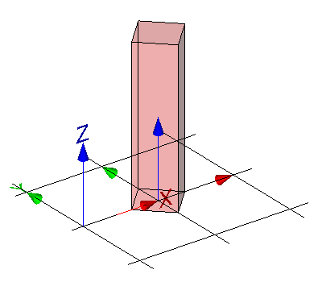

The mapped representation can be generated by a mapped item placing a mapped representation with a Cartesian transformation.

<table summary="different representation types">
 <tr>
  <td>
   
  </td>
  <td style=" vertical-align:bottom;">
   

    The representation map, being a simple block, is inserted as a mapped item for the building element proxy within its local object coordinate system.
    It is transformed by a rotation by 45' in xy plane and by a non-uniform scaling with x-scale=0.5, y-scale=0.5 and z-scale=1.0. See Figure 1.
   

  </td>	
 </tr>
 <tr style="height:20px;">
  <td style=" vertical-align:bottom;">
   
Figure 1 &mdash; Mapped representation with transformation

  </td>
  <td>&nbsp;</td>
 </tr>
</table>
