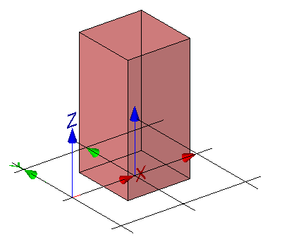

The mapped representation can be generated by a mapped item placing a mapped representation without a Cartesian transformation.

<table summary="mapped without transformation">
 <tr>
  <td>
   
  </td>
  <td style="vertical-align:bottom;">
   

    The representation map, being a simple block, is inserted as a mapped item for the building element proxy within its local object 
    coordinate system without any transformation. See Figure 1.
   

  </td>	
 </tr>
 <tr style="height:20px;">
  <td style=" vertical-align:bottom;">
   
Figure 1 &mdash; Mapped representation without transformation

  </td>
  <td>&nbsp;</td>
 </tr>
</table>
