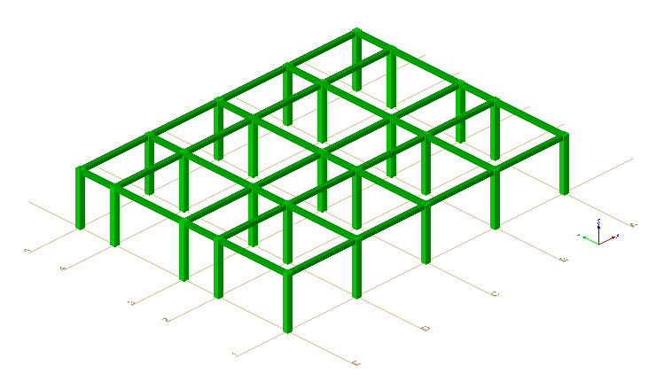

This example demonstrates object placement according to grid location. It contains a single grid with 5x5 grid lines, 25 columns with grid placement and 10 beams with local placement. Figure 1 displays the grid with axis tags and the columns and beams.

> NOTE&nbsp; There is no color information within the file, the displayed color has been set by the target application as a default.
