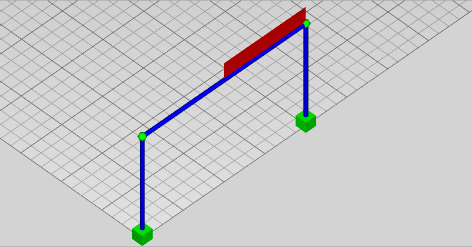
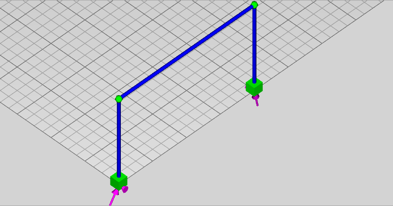
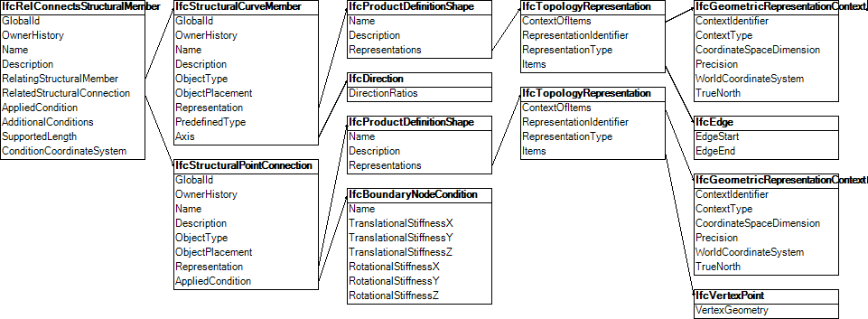
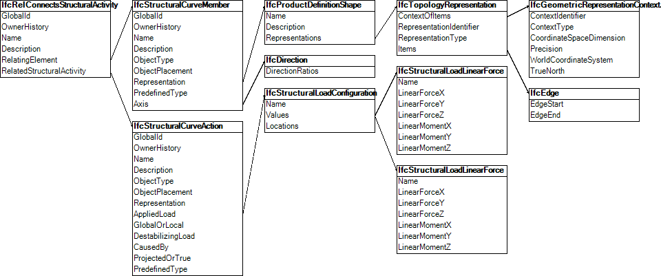

This example includes three structural curve members forming a simple frame, and a single load case of a linear distributed load.

The example includes three structural curve members connected in series, forming two columns and a beam, where the columns have rigid boundary conditions with respect to the ground. Each curve member has a material profile set defined using an I-Shape profile of steel material. The profile has properties indicating area and moments of inertia. The material has properties indicating density, modulus of elasticity, modulus of rigidity, and yield strength. One load case is defined, having a constant linear distribution over half of the beam. See Figure 1 for the geometric and topological representation of the structural members.

The load case has calculated results included, consisting of point forces and moments at each point connection on the ground. See Figure 2 for the represenation of the structural members with reactions.

The _IfcRelConnectsStructuralElements_ relationship links a curve member to a point connection. See Figure 3 for an instantiation diagram.

The _IfcRelConnectsStructuralActivity_ relationship links a load action to a curve member. See Figure 4 for an instantiation diagram.

