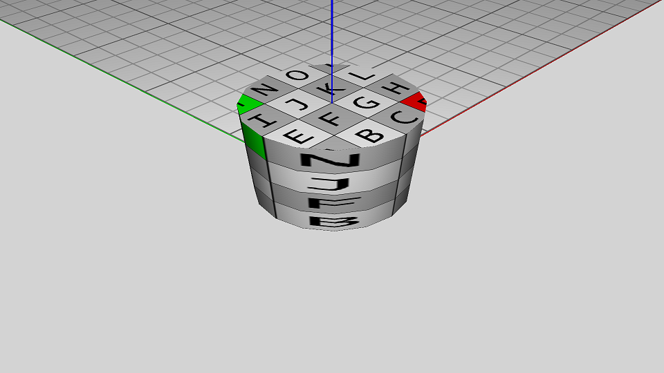

The tessellated shape representation includes an indexed texture coordinate list, providing texture vertices for each face, along with a texture embedded within the file as discrete pixels. Figure 1 shows a cylinder with faces having specific texture coordinates.

