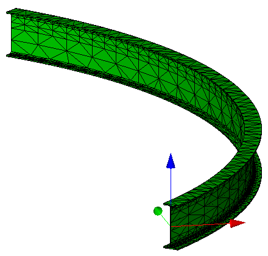
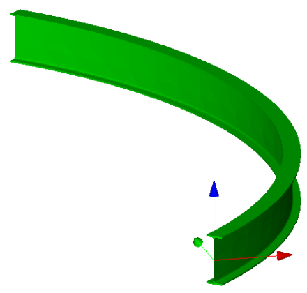

The example shows a curved beam with an I-Shape cross section being tessellated with a fine mesh. Figure 1 and Figure 2 display the rendering in a target application.

> NOTE&nbsp; The density of the mesh depends on the algorithm used by the application. In general it is recommended to not use an overly fine mesh to minimize data set sizes. The mesh density of the example is already very high.

The example shows a tessellation without adding the normals at each vertex to the data set.

<table summary="curved beam tessellated">
 <tr>
  <td>
   
  </td>
  <td>
   
  </td>
 </tr>
 <tr style="height:20px;">
  <td style=" vertical-align:bottom;">
   
Figure 1 &mdash; tessellated curved beam visualized with edges visible

  </td>
  <td style=" vertical-align:bottom;">
   
Figure 2 &mdash; tessellated curved beam visualized without edges

  </td>
 </tr>
</table>

> NOTE&nbsp; There is no color information within the file, the displayed color has been set by the target application as a default.
