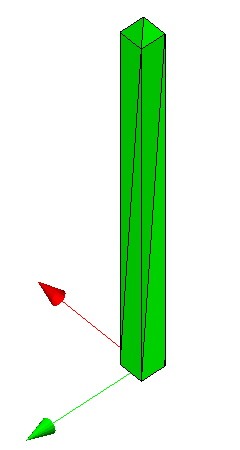
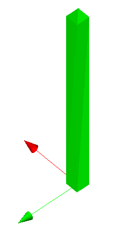

The example shows a straight column with a rectangular cross section being tessellated with a mesh. Figure 1 and Figure 2 display the rendering in a target application.

The example shows a tessellation with adding the normals at each vertex to the data set. The list of vertices given by the _IfcCartesianPointList3D_ and the list of normals given by the _IfcTriangulatedFaceSet_.Normals are corresponding lists, therefore the _IfcTriangulatedFaceSet_.NormalIndex is not provided and the _IfcTriangulatedFaceSet_.CoordIndex applies to both lists.

<table summary="straight beam tessellated">
 <tr>
  <td>
   
  </td>
  <td>
   
  </td>
 </tr>
 <tr style="height:20px;">
  <td style=" vertical-align:bottom;">
   
Figure 1 &mdash; tessellated rectangular  column visualized with edges visible

  </td>
  <td style=" vertical-align:bottom;">
   
Figure 2 &mdash; tessellated rectangular  column visualized without edges

  </td>
 </tr>
</table>

> NOTE&nbsp; There is no color information within the file, the displayed color has been set by the target application as a default.
