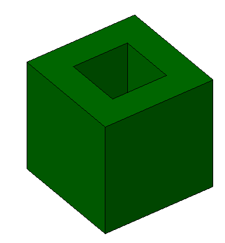

The example shows a cube with a recess being tessellated using polygonal faces without and with voids. Figure 1 displays the rendering in a target application.

> NOTE&nbsp; There is no color information within the file, the displayed color has been set by the target application as a default.
