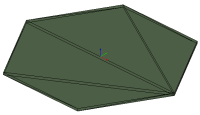
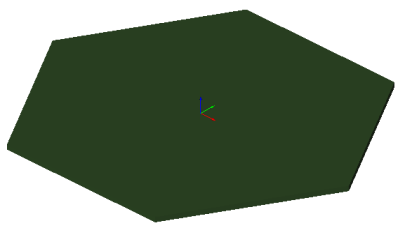

The example shows a hexagonal slab being tessellated with a mesh. Figure 1 and Figure 2 display the rendering in a target application. The tessellation uses a list of unique vertices stored in the _IfcCartesianPointList3D_. No normals are provided.

&nbsp;

<table summary="hexagonal slab tessellated">
 <tr>
  <td>
   
  </td>
  <td>
   
  </td>
 </tr>
 <tr style="height:20px;">
  <td style=" vertical-align:bottom;">
   
Figure 1 &mdash; tessellated hexagonal slab  visualized with edges visible

  </td>
  <td style=" vertical-align:bottom;">
   
Figure 2 &mdash; tessellated hexagonal slab  visualized without edges

  </td>
 </tr>
</table>

> NOTE&nbsp; There is no color information within the file, the displayed color has been set by the target application as a default. The transparency has been set in the target application.
