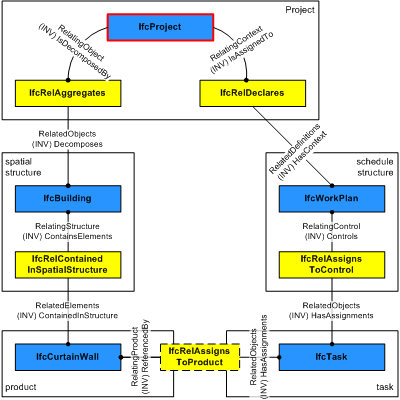
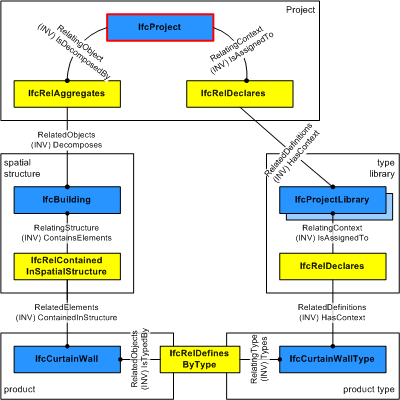

_IfcProject_ indicates the undertaking of some design, engineering, construction, or maintenance activities leading towards a product. The project establishes the context for information to be exchanged or shared, and it may represent a construction project but does not have to. The _IfcProject_'s main purpose in an exchange structure is to provide the root instance and the context for all other information items included.

The context provided by the _IfcProject_ includes:

* the default units
* the geometric representation context for exchange structures including shape representations 
    * the world coordinate system
    * the coordinate space dimension
    * the precision used within the geometric representations, and
    * optionally the indication of the true north relative to the world coordinate system 

> HISTORY&nbsp; New entity in IFC1.0

{ .change-ifc2x4}
> IFC4 CHANGE&nbsp; The attributes _RepresentationContexts_ and _UnitsInContext_ are made optional and are promoted to supertype _IfcContext_.

{ .spec-head}
Informal Propositions:

1. There shall only be one project within the exchange context. This is enforced by the global rule _IfcSingleProjectInstance_.

___
## Common Use Definitions
The following concepts are inherited at supertypes:

* _IfcRoot_: [Identity](../../templates/identity.htm), [Revision Control](../../templates/revision-control.htm)

[&nbsp;Instance diagram](../../../annex/annex-d/common-use-definitions/ifcproject.htm)

{ .use-head}
Project Declaration

The [Project Declaration](../../templates/project-declaration.htm) concept applies to this entity as shown in Table 1.

<table>
<tr><td>
<table class="gridtable">
<tr><th><b>Type</b></th><th><b>Description</b></th></tr>
<tr><td><a href="../../ifckernel/lexical/ifcprojectlibrary.htm">IfcProjectLibrary</a></td><td>Referenced projects incorporated into this project.</td></tr>
<tr><td><a href="../../ifckernel/lexical/ifcpropertysettemplate.htm">IfcPropertySetTemplate</a></td><td>Property set templates defined by this project.</td></tr>
<tr><td><a href="../../ifckernel/lexical/ifctypeobject.htm">IfcTypeObject</a></td><td>Type definition defined by this project.</td></tr>
<tr><td><a href="../../ifckernel/lexical/ifcactor.htm">IfcActor</a></td><td>Actors participating in this project.</td></tr>
<tr><td><a href="../../ifckernel/lexical/ifccontrol.htm">IfcControl</a></td><td>Controls issued within this project.</td></tr>
<tr><td><a href="../../ifckernel/lexical/ifcgroup.htm">IfcGroup</a></td><td>Groups defined by this project.</td></tr>
<tr><td><a href="../../ifckernel/lexical/ifcprocess.htm">IfcProcess</a></td><td>Processes defined by this project.</td></tr>
<tr><td><a href="../../ifckernel/lexical/ifcresource.htm">IfcResource</a></td><td>Resources defined by this project.</td></tr>
</table>
</td></tr>
<tr><td>
Table 1 &mdash; IfcProject Project Declaration
</td></tr></table>

The _IfcProject_ is also the context for other information about the construction project such as a work plan. Non-product structures are assigned by their first level object to _IfcProject_ using the _IfcRelDeclares_ relationship.

The _IfcProject_ provides the context for spatial elements and the associated products, and for work plans (or other non-product based) descriptions of the construction project. It is handled by two distinct relationship objects as shown in Figure 2.

> NOTE&nbsp; The spatial structure and the schedule structure can be decomposed. For example the _IfcBuilding_ can be decomposed into _IfcBuildingStorey_'s, and the _IfcWorkPlan_ can be decomposed into _IfcWorkSchedule_'s.

> NOTE&nbsp; The products and tasks can be decomposed further. For example the _IfcCurtainWall_ can be decomposed into _IfcMember_ and _IfcPlate_, the _IfcTask_ can be decomposed into other _IfcTask_'s.

> NOTE&nbsp; The products and tasks can have direct linking relationships. For example the _IfcCurtainWall_ can be assigned to a _IfcTask_ as an input or output for a construction schedule.

> NOTE&nbsp; The anomaly to use the composition structure through _IfcRelAggregates_ for assigning the uppermost spatial container to _IfcProject_ is due to upward compatibility reasons with earlier releases of this standard.

Figure 1 illustrates the context for project libraries that in return provide a context to the library items assigned to it. Product types are an example for items that can be included in a project library.

Figure 2 illustrates project relationships with spatial structures, products, and type libraries.

  
  
{ .use-head}
Spatial Decomposition

The [Spatial Decomposition](../../templates/spatial-decomposition.htm) concept applies to this entity as shown in Table 2.

<table>
<tr><td>
<table class="gridtable">
<tr><th><b>Spatial Parts</b></th><th><b>Description</b></th></tr>
<tr><td><a href="../../ifcproductextension/lexical/ifcsite.htm">IfcSite</a></td><td>If referenced, the site is the root of the spatial structure.</td></tr>
<tr><td><a href="../../ifcproductextension/lexical/ifcbuilding.htm">IfcBuilding</a></td><td>If referenced, the building is the root of the spatial structure (no explicit site information included).</td></tr>
<tr><td><a href="../../ifcproductextension/lexical/ifcspatialzone.htm">IfcSpatialZone</a></td><td>If referenced, the spatial zone is the root of the spatial structure (to be used as a stub for non-building related projects).</td></tr>
</table>
</td></tr>
<tr><td>
Table 2 &mdash; IfcProject Spatial Decomposition
</td></tr></table>

The _IfcProject_ is used to reference the root of the spatial structure of a building or other construction project (that serves as the primary project breakdown and is required to be hierarchical). The spatial structure elements are linked together, and to the _IfcProject_, by using the objectified relationship _IfcRelAggregates_.

{ .use-head}
Project Units

The [Project Units](../../templates/project-units.htm) concept applies to this entity as shown in Table 3.

<table>
<tr><td>
<table class="gridtable">
<tr><th><b>NamedUnitType</b></th><th><b>DerivedUnitType</b></th><th><b>Description</b></th></tr>
<tr><td><a href="../../ifcmeasureresource/lexical/ifcunitenum.htm">LENGTHUNIT</a></td><td>&nbsp;</td><td>Length unit as meters, millimeters, or inches.</td></tr>
<tr><td><a href="../../ifcmeasureresource/lexical/ifcunitenum.htm">PLANEANGLEUNIT</a></td><td>&nbsp;</td><td>Angle unit as degrees or radians.</td></tr>
</table>
</td></tr>
<tr><td>
Table 3 &mdash; IfcProject Project Units
</td></tr></table>

  
  
{ .use-head}
Project Context

The [Project Context](../../templates/project-context.htm) concept applies to this entity as shown in Table 4.

<table>
<tr><td>
<table class="gridtable">
<tr><th><b>ContextIdentifier</b></th><th><b>ContextType</b></th><th><b>Description</b></th></tr>
<tr><td>Model</td><td>3D</td><td>Context for all 3D geometry.</td></tr>
<tr><td>Plan</td><td>2D</td><td>Context for all 2D annotations.</td></tr>
</table>
</td></tr>
<tr><td>
Table 4 &mdash; IfcProject Project Context
</td></tr></table>

  
  
{ .use-head}
Project Classification Information

The [Project Classification Information](../../templates/project-classification-information.htm) concept applies to this entity.

  
  
{ .use-head}
Project Document Information

The [Project Document Information](../../templates/project-document-information.htm) concept applies to this entity.

  
  
{ .use-head}
Project Library Information

The [Project Library Information](../../templates/project-library-information.htm) concept applies to this entity.
