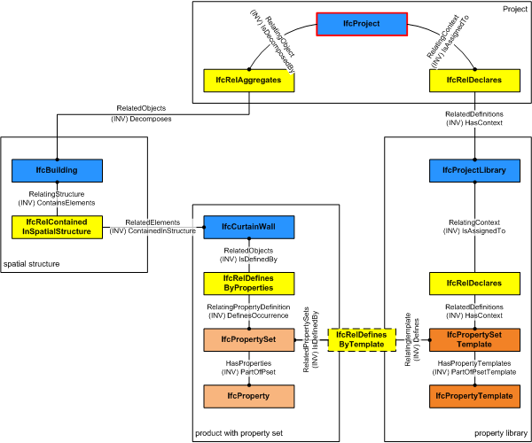

_IfcPropertySetTemplate_ defines the template for all dynamically extensible property sets represented by _IfcPropertySet_. The property set template is a container of property templates within a property tree. The individual property templates are interpreted according to their _Name_ attribute and shall have no values assigned.

> NOTE&nbsp; By convention an _IfcPropertySetTemplate_ can also be used as a template for an _IfcElementQuantity_, being a particular type of a property set definition.

Property set templates can form part of a property library used and declared within a project. Depending on the _TemplateType_ the _IfcPropertySetTemplate_ defines a template for:

* "Pset_" - occurrences of _IfcPropertySet_
* "QTO_" - occurrences of _IfcElementQuantity_

The inherited _HasContext_ inverse relation to _IfcRelDeclares_ is used to declare the _IfcPropertySetTemplate_ within a project library. If included in an exchange data set it can then be traversed through the _IfcProjectLibrary_. The _Defines_ inverse relation to _IfcRelDefinesByTemplate_ is provided to keep the definition relationship between the _IfcPropertySetTemplate_ and the one to many _IfcPropertySet_'s, for which it provides the template. Figure 1 illustrates relationships used for property set templates.

&nbsp;

Between _IfcProperty_'s within the _HasProperties_ set of _IfcPropertySet_ having the same _Name_ attribute value as the _IfcPropertyTemplate_'s within the _HasPropertyTemplates_ set of _IfcPropertySetTemplate_ an implicit definition relationship is established that assigns the template to the individual properties.

> HISTORY&nbsp; New entity in IFC4.