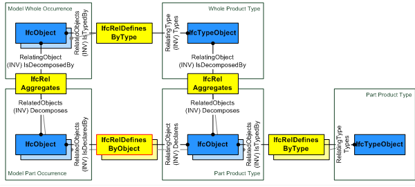
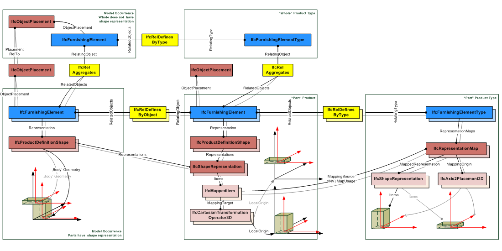

The objectified relationship _IfcRelDefinesByObject_ defines the relationship between an object taking part in an object type decomposition and an object occurrences taking part in an occurrence decomposition of that type.

The _IfcRelDefinesByObject_ is a 1-to-N relationship, as it allows for the assignment of one declaring object information to a single or to many reflected objects. Those objects then share the same object property sets and, for subtypes of _IfcProduct_, the eventually assigned representation maps.

Only objects that take part in a type decomposition and in an occurrence decomposition of the same type can be connected by the _IfcRelDefinesByObject_ relationship. The _IfcRelDefinesByObject_ links the decomposed object type part, also called the "declaring part" with the occurrence of that part inside the occurrence of the decomposed type, also called the "reflected part", as shown in Figure 1.

&nbsp;

The _IfcRelDefinesByObject_ can be used together with the shape representations of the product type as shown in Figure 2. The _IfcShapeRepresentation_ of the "declaring part" is referenced by the "reflected part". The _IfcObjectPlacement_ of the model occurrence (the whole) determines the position within the project context.

> HISTORY&nbsp; New entity in IFC4.