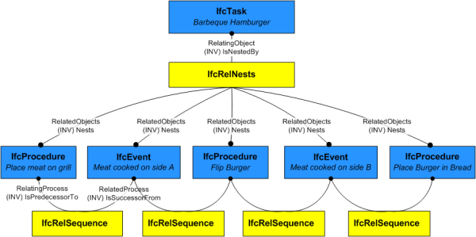

An _IfcProcedure_ is a logical set of actions to be taken in response to an event or to cause an event to occur.

> HISTORY&nbsp; New entity in IFC2x2

{ .change-ifc2x4}
> IFC4 CHANGE&nbsp; _ProcedureType_ renamed to _PredefinedType_ and made optional (upward compatible). Where rules WR1 and WR2 have been removed.

{ .use-head}
Use definitions

_IfcProcedure_ is used to capture information about stepped processes such as calibration, start/stop procedures for equipment items, designated actions to take in the event of an emergency etc. A procedure is not a task, but may describe a set of tasks and their order of occurrence in response to or to cause an event.

As shown in Figure 11, _IfcProcedure_ does not restrict anything but describes specific steps of how something should happen. While a procedure does control/restrict in the sense of indicating "this is how the task should be performed" by nature of describing inner detail, this is not different than parts of a product indicating "this is how the parts should be assembled". Consequently, it doesn't restrict the outer item as a whole but provides inner detail of the item.

___
## Common Use Definitions
The following concepts are inherited at supertypes:

* _IfcRoot_: [Identity](../../templates/identity.htm), [Revision Control](../../templates/revision-control.htm)

[&nbsp;Instance diagram](../../../annex/annex-d/common-use-definitions/ifcprocedure.htm)

{ .use-head}
Object Typing

The [Object Typing](../../templates/object-typing.htm) concept applies to this entity as shown in Table 1.

<table>
<tr><td>
<table class="gridtable">
<tr><th><b>Type</b></th></tr>
<tr><td><a href="../../ifcprocessextension/lexical/ifcproceduretype.htm">IfcProcedureType</a></td></tr>
</table>
</td></tr>
<tr><td>
Table 1 &mdash; IfcProcedure Object Typing
</td></tr></table>

_IfcProcedure_ defines the anticipated or actual occurrence of any procedure; common information about procedure types is handled by _IfcProcedureType_.

  
  
{ .use-head}
Property Sets for Objects

The [Property Sets for Objects](../../templates/property-sets-for-objects.htm) concept applies to this entity as shown in Table 2.

<table>
<tr><td>
<table class="gridtable">
<tr><th><b>PredefinedType</b></th><th><b>Name</b></th></tr>
<tr><td>&nbsp;</td><td><a href="../../psd/ifcsharedfacilitieselements/Pset_Risk.xml">Pset_Risk</a></td></tr>
</table>
</td></tr>
<tr><td>
Table 2 &mdash; IfcProcedure Property Sets for Objects
</td></tr></table>

  
  
{ .use-head}
Object Nesting

The [Object Nesting](../../templates/object-nesting.htm) concept applies to this entity.

The _IfcProcedure_ may be contained within an _IfcTask_ or _IfcProcedure_ using the _IfcRelNests_ relationship. An _IfcProcedure_ may in turn nest other _IfcProcedure_ or _IfcEvent_ entities. Such nesting indicates decomposed level of detail.

  
  
{ .use-head}
Sequential Connectivity

The [Sequential Connectivity](../../templates/sequential-connectivity.htm) concept applies to this entity.

The relationship _IfcRelSequence_ is used to indicate control flow. An _IfcProcedure_ as a successor to an _IfcEvent_ indicates that the procedure should be performed in response to the event. An _IfcProcedure_ as a predecessor to an _IfcEvent_ indicates that the event should be trigerred following the procedure. As procedures have arbitrary duration, the _IfcRelSequence.SequenceType_ attribute has no effect on an _IfcProcedure_ but still applies to the opposite end of the relationship if _IfcTask_ is used.

  
  
{ .use-head}
Process Assignment

The [Process Assignment](../../templates/process-assignment.htm) concept applies to this entity.

> NOTE&nbsp; A particular type of _IfcProcedure_ is a caution, warning or other form of advisory note. Typically, it is anticipated that such a procedure would be assigned to the specific _IfcProcess_ for which it gives advice using _IfcRelAssignsToProcess_.

  
  
{ .use-head}
Control Assignment

The [Control Assignment](../../templates/control-assignment.htm) concept applies to this entity.

An _IfcProcedure_ may be assigned to an _IfcWorkCalendar_ to indicate times when such procedure may be performed using _IfcRelAssignsToControl_; otherwise the effective calendar is determined by the nearest _IfcProcess_ ancestor with a calendar assigned. Advisory notes should be assigned to the specific _IfcProcess_ for which it gives advice using _IfcRelAssignsToProcess_.

  
  
{ .use-head}
Product Assignment

The [Product Assignment](../../templates/product-assignment.htm) concept applies to this entity.

For building operation scenarios, _IfcProcedure_ may be assigned to a product (_IfcElement_ subtype) using _IfcRelAssignsToProduct_ to indicate a specific product occurrence that performs the procedure.

> EXAMPLE&nbsp; An _IfcActuator_ may have a "Close" procedure. If the _IfcProcedure_ is defined by an _IfcProcedureType_ and the _IfcProcedureType_ is assigned to a product type (using _IfcRelAssignsToProduct_), then the _IfcProcedure_ must be assigned to one or more occurrences of the specified product type using _IfcRelAssignsToProduct_.