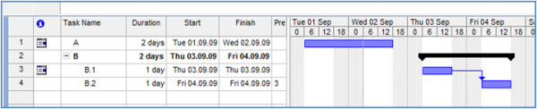
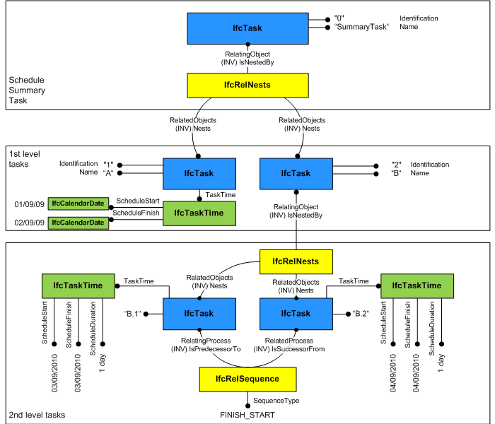
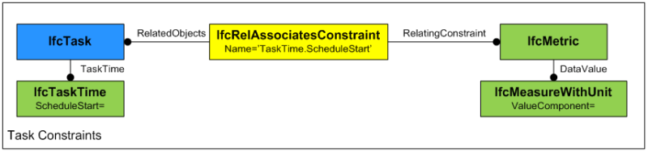

An _IfcTask_ is an identifiable unit of work to be carried out in a construction project.

A task is typically used to describe an activity for the construction or installation of products, but is not limited to these types. For example it might be used to describe design processes, move operations and other design, construction and operation related activities as well.

Quantities of resources consumed by the task are dealt with by defining the _IfcElementQuantity_ for the resource and not at the instance of _IfcTask_.

> HISTORY&nbsp; New entity in IFC1.0. Renamed from _IfcWorkTask_ in IFC2x.

{ .change-ifc2x4}
> IFC4 CHANGE&nbsp; Attributes _TaskTime_ and _PredefinedType_ added. IfcMove and IfcOrderRequest has been removed in IFC4 and are now represented by _IfcTask_. IfcRelAssignsTasks relationship has been removed as well.

{ .use-head}
Attribute use definition

Each occurrence of _IfcTask_ is given a name that is indicative of its content (_IfcRoot.Name_). A textual description of the task may be provided and this may be further elaborated by a narrative long description (_IfcProcess.LongDescription_). A work method may be declared for the method of work used in carrying out a task. A task is identified as being either a milestone task or not. A milestone task is defined by the marker _IsMilestone_. and has no duration. A status and priority for each task may also be set.

{ .use-head}
Time and duration use definition

Compared to previous IFC releases, basic task time information (scheduled start time, scheduled finish time, duration) is now directly attached to _IfcTask_ through the _TaskTime_ attribute. Regular tasks are defined through _IfcTaskTime_. Recurring tasks are defined through _IfcTaskTimeRecurring_. In case a regular task is derived from a recurring task both tasks should be linked together through a _IfcRelNests_ relationship, where _IfcRelNests.IsNestedBy_ points to the recurring task and _IfcRelNests.Nests_ points to all regular tasks that have been derived from the recurring task.

{ .use-head}
Representation of other activities

The use definitions for _IfcTask_ have been generalised to represent other activities as well, including activities that had been defined by own entities in previous IFC releases. This includes

* Order actions
* Move operations

_IfcTask_ represents an order that might be carried out by a Helpdesk acting the role of interface for the organization between the facility user and the functional requirement of fulfilling their needs. The actual task represented by the _IfcTask_ entity is turning a request into an order and initiating the action that will enable the order to be completed. The _IfcProjectOrder_ or one of its subtypes including maintenance work order, is related to the _IfcTask_ using _IfcRelAssignsToControl_.

_IfcTask_ can also be used to describe an activity that moves people, groups within an organization or complete organizations together with their associated furniture and equipment from one place to another. It thus replaces the previous IFC entity IfcMove. The functionality is represented in _IfcTask_ as follows:

* Move from: The place from which actors and their associated equipment are moving.   Use _IfcRelAssignsToProcess_ where _RelatingProcess_ points to the task and _RelatedObjects_ holds the location(s) from which to move.
* Move to: The place to which actors and their associated equipment are moving.   Use _IfcRelAssignsToProduct_ where _RelatedObjects_ points to the task(s) and _RelatingProduct_ points to the location to which to move.
* Punch list: A list of points concerning a move that require attention.   Use _LongDescription_ or else identify sub-tasks to track punch list items individually via _IfcRelNests_.

___
## Common Use Definitions
The following concepts are inherited at supertypes:

* _IfcRoot_: [Identity](../../templates/identity.htm), [Revision Control](../../templates/revision-control.htm)

[&nbsp;Instance diagram](../../../annex/annex-d/common-use-definitions/ifctask.htm)

{ .use-head}
Object Typing

The [Object Typing](../../templates/object-typing.htm) concept applies to this entity as shown in Table 1.

<table>
<tr><td>
<table class="gridtable">
<tr><th><b>Type</b></th></tr>
<tr><td><a href="../../ifcprocessextension/lexical/ifctasktype.htm">IfcTaskType</a></td></tr>
</table>
</td></tr>
<tr><td>
Table 1 &mdash; IfcTask Object Typing
</td></tr></table>

The _IfcTask_ defines the anticipated or actual occurrence of any task; common information about task types is handled by _IfcTaskType_.

> EXAMPLE&nbsp; It includes fixed duration, fixed unit or fixed work. An _IfcTask_ can be aggregated to a task type in order to specify a task sequence or any time related information, e.g. the duration of a task. Please see the documentation of _IfcTaskType_ for further information.

  
  
{ .use-head}
Property Sets for Objects

The [Property Sets for Objects](../../templates/property-sets-for-objects.htm) concept applies to this entity as shown in Table 2.

<table>
<tr><td>
<table class="gridtable">
<tr><th><b>PredefinedType</b></th><th><b>Name</b></th></tr>
<tr><td>&nbsp;</td><td><a href="../../psd/ifcsharedfacilitieselements/Pset_Risk.xml">Pset_Risk</a></td></tr>
</table>
</td></tr>
<tr><td>
Table 2 &mdash; IfcTask Property Sets for Objects
</td></tr></table>

  
  
{ .use-head}
Object Nesting

The [Object Nesting](../../templates/object-nesting.htm) concept applies to this entity.

_IfcTask_ may be contained within an _IfcTask_ using the _IfcRelNests_ relationship. An _IfcTask_ may in turn nest other _IfcTask_, _IfcProcedure_ or _IfcEvent_ entities. Such nesting indicates decomposed level of detail. From IFC4 onwards it is required to have a summary task (root of all tasks), which is used to define a link to the work plan or work schedule. All subtasks of the summary tasks are then implicitly linked to this work plan or work schedule. Please note that the summary task is used for data organization and not meant to store typical task information as defined by the user. It is therefore recommended that the summary task is hidden from the user to avoid confusion. Please also note that _IfcRelNests_ is used to show the dependency between regular tasks and recurring task definitions (please see the section about time and duration use definitions).

As shown in Figure 1, the installation of a number of items of equipment within a particular space may be the subject of a single task which is identified as 'fix equipment in space 123'. _IfcTask_ represents the occurrence of a work performance of a type of process in a construction plan.

A task may nest other tasks as sub-items; the nesting relationship is modeled by _IfcRelNests_ as shown in Figure 2. For example, the construction of a stud wall may be designated as a nesting task named 'install wall #1' including other tasks such as 'install dry wall', 'install studs', 'wall taping', and 'erect wall' as sub-processes. A value that indicates the relative tree view position of the task (in comparison to the tree view position of other tasks and the task hierarchy defined by _IfcRelNests_).

The task order information that is used for viewing purposes is derived from the order defined by the _IfcRelNests_ relationship and thus is independent of the logical task order defined through _IfcRelSequence_. The hierarchy and order defined through _IfcRelNests_ enables to order the tasks in a tree view or list view structure.

  
  
{ .use-head}
Sequential Connectivity

The [Sequential Connectivity](../../templates/sequential-connectivity.htm) concept applies to this entity.

The relationship _IfcRelSequence_ is used to indicate control flow. An _IfcTask_ as a successor to an _IfcTask_ indicates logical sequence how these tasks should be performed. _IfcTask_'s can be triggered or can trigger _IfcEvent_'s, which is also defined through the relationship _IfcRelSequence_.

  
  
{ .use-head}
Control Assignment

The [Control Assignment](../../templates/control-assignment.htm) concept applies to this entity.

Occurrences of _IfcTask_ may be assigned to an _IfcWorkControl_ (either a work plan or a work schedule) through _IfcRelAssignsToControl_. Please note that the _IfcRelAssignsTasks_ relationship class has been removed in IFC4 and is no longer available.

  
  
{ .use-head}
Process Assignment

The [Process Assignment](../../templates/process-assignment.htm) concept applies to this entity.

It is suggested to use the 'summary task' (root element of the task hierarchy that is required for task management purposes) to assign all subtask to a work plan or work schedule. Resources used by tasks are assigned by _IfcRelAssignsToProcess_.

  
  
{ .use-head}
Product Assignment

The [Product Assignment](../../templates/product-assignment.htm) concept applies to this entity.

  
  
{ .use-head}
Object Classification

The [Object Classification](../../templates/object-classification.htm) concept applies to this entity.

An _IfcTask_ may be assigned a Work Breakdown Structure (WBS) code. A WBS code is dealt with as a classification of task and is associated to a task occurrence using the _IfcRelAssociatesClassification_ relationship class. As well as being to designate the code, the classification structure also enables the source of the work breakdown structure classification to be identified.

  
  
{ .use-head}
Object Constraint

The [Object Constraint](../../templates/object-constraint.htm) concept applies to this entity as shown in Table 3.

<table>
<tr><td>
<table class="gridtable">
<tr><th><b>DataValue</b></th><th><b>Attribute1</b></th><th><b>Attribute2</b></th><th><b>Description</b></th></tr>
<tr><td>&nbsp;</td><td>&nbsp;</td><td>&nbsp;</td><td>Indicate fixed duration of task with ConstraintGrade=HARD and Benchmark=EQUALTO such that changes to an assigned <i>IfcConstructionResource.ResourceTime.ScheduleWork</i> should impact <i>IfcConstructionResource.ResourceTime.ScheduleUsage</i>, and vice-versa. </td></tr>
</table>
</td></tr>
<tr><td>
Table 3 &mdash; IfcTask Object Constraint
</td></tr></table>

Constraints may be applied to a task to indicate fixed task duration, fixed start or fixed finish (see Figure 147). The relationship _IfcRelAssociatesConstraint_ is used where _RelatingConstraint_ points to an _IfcMetric_ and _RelatedObjects_ includes the _IfcTask_. _IfcRelAssociatesConstraint.Name_ identifies the attribute to be constrained using a period (".") to dereference; for example, "TaskTime.ScheduleStart" refers to the _ScheduleStart_ attribute on the _IfcTaskTime_ entity referenced on the _TaskTime_ attribute. The following attributes may be constrained (see Table 11 with Constrained Attribute):

*  **'TaskTime.ScheduleDuration'**: Indicate fixed duration of task with ConstraintGrade=HARD and Benchmark=EQUALTO such that changes to an assigned _IfcConstructionResource.ResourceTime.ScheduleWork_ should impact _IfcConstructionResource.ResourceTime.ScheduleUsage_, and vice-versa. 
*  **'TaskTime.ScheduleStart'**: Indicate constrained start date with ConstraintGrade=HARD and Benchmark of EQUALTO, GREATERTHANOREQUALTO, or LESSTHANOREQUALTO to indicate "must start on", "start no earlier than" or "start no later than" respectively where _IfcMetric.DataValue_ indicates the specific _IfcDateTime_. Use SOFT constraint having LESSTHAN benchmark to indicate "start as soon as possible". 
*  **'TaskTime.ScheduleFinish'**: Indicate constrained finish date with ConstraintGrade=HARD and Benchmark of EQUALTO, GREATERTHANOREQUALTO, or LESSTHANOREQUALTO to indicate "must finish on", "finish no earlier than" or "finish no later than" respectively where _IfcMetric.DateValue_ indicates the specific _IfcDateTime_. Use SOFT constraint having GREATERTHAN benchmark to indicate "finish as late as possible". 

A "manual scheduled task" is indicated with ConstraintGrade=HARD and Benchmark=EQUALTO for both _TaskTime.ScheduleStart_ and _TaskTime.ScheduleFinish_.

