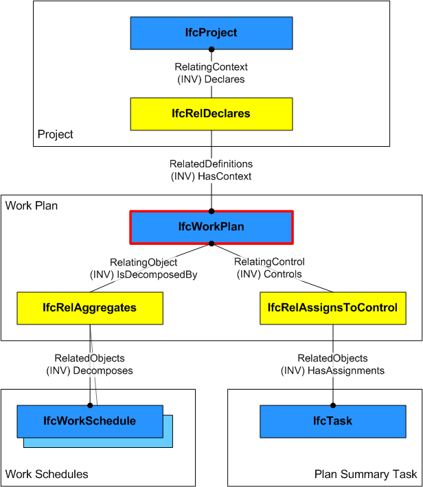

An _IfcWorkPlan_ represents work plans in a construction or a facilities management project.

> HISTORY&nbsp; New entity in IFC2.0

A work plan contains a set of work schedules for different purposes (including construction and facilities management). Contained work schedules are defined through the _IfcRelAggregates_ relationship. Through inheritance from _IfcWorkControl_ it is also possible to define references to activities (for example, _IfcTask_) and resources used in the work plan.

A work plan has information such as start date, finish date, total free float, and so on. _IfcWorkPlan_ can also refer to the construction project represented by the single _IfcProject_ instance (please also check the definition of _IfcWorkControl_).

Figure 1 shows the backbone structure of a work plan that defines (1) contained work schedules through _IfcRelAggregates_ and (2), if not assigned otherwise to contained work schedules, assigned tasks and resources through _IfcRelAssignsToControl_.

___
## Common Use Definitions
The following concepts are inherited at supertypes:

* _IfcRoot_: [Identity](../../templates/identity.htm), [Revision Control](../../templates/revision-control.htm)
* _IfcWorkControl_: [Control Assignment](../../templates/control-assignment.htm)

[&nbsp;Instance diagram](../../../annex/annex-d/common-use-definitions/ifcworkplan.htm)

{ .use-head}
Property Sets for Objects

The [Property Sets for Objects](../../templates/property-sets-for-objects.htm) concept applies to this entity as shown in Table 1.

<table>
<tr><td>
<table class="gridtable">
<tr><th><b>PredefinedType</b></th><th><b>Name</b></th></tr>
<tr><td>&nbsp;</td><td><a href="../../psd/ifcprocessextension/Pset_WorkControlCommon.xml">Pset_WorkControlCommon</a></td></tr>
</table>
</td></tr>
<tr><td>
Table 1 &mdash; IfcWorkPlan Property Sets for Objects
</td></tr></table>