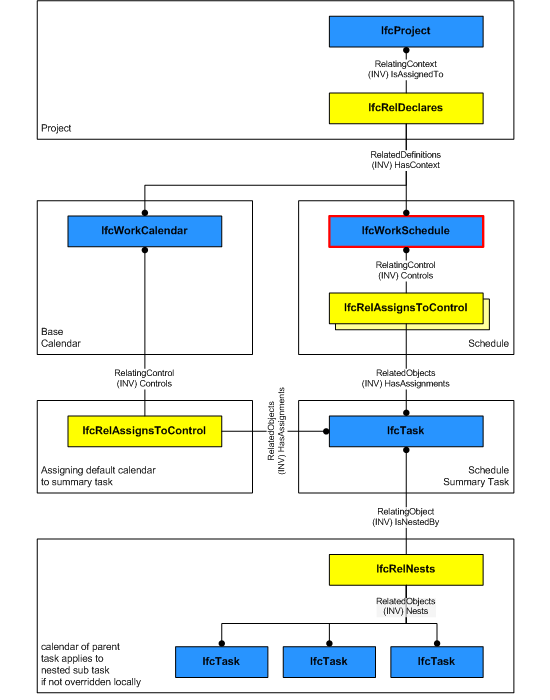

An _IfcWorkSchedule_ represents a task schedule of a work plan, which in turn can contain a set of schedules for different purposes.

> HISTORY&nbsp; New entity in IFC2.0.

{ .use-head}
Declaration Use Definition

_IfcWorkSchedule_ can reference a project (the single _IfcProject_ instance) via _IfcRelDeclares_.

Figure 1 shows the backbone structure of a work schedule that defines (1) a context through _IfcRelDeclares_ (not necessarily the project) and (2) controls tasks (typically the schedule summary task) and resources. Please note that a work calendar shall be assigned to the summary task and not the work schedule.

___
## Common Use Definitions
The following concepts are inherited at supertypes:

* _IfcRoot_: [Identity](../../templates/identity.htm), [Revision Control](../../templates/revision-control.htm)

[&nbsp;Instance diagram](../../../annex/annex-d/common-use-definitions/ifcworkschedule.htm)

{ .use-head}
Property Sets for Objects

The [Property Sets for Objects](../../templates/property-sets-for-objects.htm) concept applies to this entity as shown in Table 1.

<table>
<tr><td>
<table class="gridtable">
<tr><th><b>PredefinedType</b></th><th><b>Name</b></th></tr>
<tr><td>&nbsp;</td><td><a href="../../psd/ifcprocessextension/Pset_WorkControlCommon.xml">Pset_WorkControlCommon</a></td></tr>
</table>
</td></tr>
<tr><td>
Table 1 &mdash; IfcWorkSchedule Property Sets for Objects
</td></tr></table>

  
  
{ .use-head}
Object Documentation

The [Object Documentation](../../templates/object-documentation.htm) concept applies to this entity.

The documents of the _IfcWorkSchedule_ can be referenced by the _IfcRelAssociatesDocuments_ relationship.

  
  
{ .use-head}
Control Assignment

The [Control Assignment](../../templates/control-assignment.htm) concept applies to this entity.

An _IfcWorkSchedule_ controls a set of tasks and resources defined through _IfcRelAssignsToControl_. Additionally, through the _IfcWorkControl_ abstract supertype, the actors creating the schedule can be specified and schedule time information such as start time, finish time, and total float of the schedule can also be specified.

  
  
{ .use-head}
Object Nesting

The [Object Nesting](../../templates/object-nesting.htm) concept applies to this entity.

A work schedule can include other work schedules as sub-items through _IfcRelNests_ relationship.

  
  
{ .use-head}
Object Aggregation

The [Object Aggregation](../../templates/object-aggregation.htm) concept applies to this entity.

A work schedule can include other work schedules as sub-items. If not included in another work schedule it might be a part of a work plan (_IfcWorkPlan_) defined through _IfcRelAggregates_ relationship.
