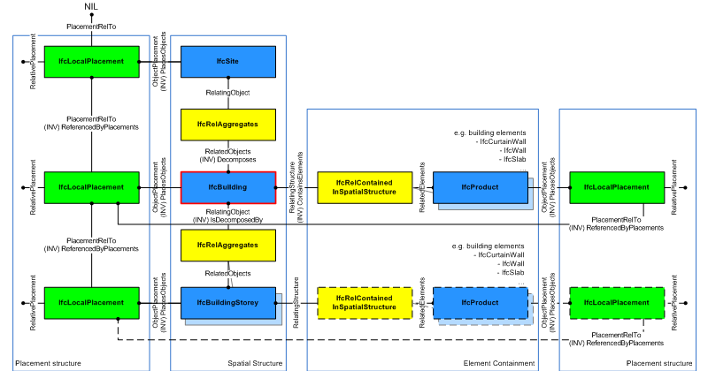
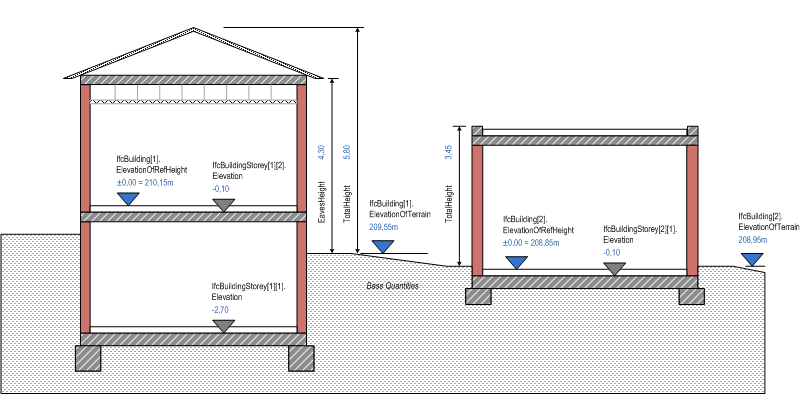

A building represents a structure that provides shelter for its occupants or contents and stands in one place. The building is also used to provide a basic element within the spatial structure hierarchy for the components of a building project (together with site, storey, and space).

{ .extDef}
> NOTE&nbsp; Definition from ISO 6707-1:  
> Construction work that has the provision of shelter for its occupants or contents as one of its main purpose and is normally designed to stand permanently in one place.

A building is (if specified) associated to a site. A building may span over several connected or disconnected buildings. Therefore building complex provides for a collection of buildings included in a site. A building can also be decomposed in (vertical) parts, where each part defines a building section. This is defined by the composition type attribute of the supertype _IfcSpatialStructureElements_ which is interpreted as follow:

* **COMPLEX**: building complex
* **ELEMENT**: building
* **PARTIAL**: building section

The _IfcBuilding_ is used to build the spatial structure of a building (that serves as the primary project breakdown and is required to be hierarchical). The spatial structure elements are linked together by using the objectified relationship _IfcRelAggregates_.

> HISTORY&nbsp; New entity in IFC1.0.

Figure 1 shows the _IfcBuilding_ as part of the spatial structure. It also serves as the spatial container for building and other elements.

> NOTE&nbsp; Detailed requirements on mandatory element containment and placement structure relationships are given in view definitions and implementer agreements.

Systems, such as building service or electrical distribution systems, zonal systems, or structural analysis systems, relate to _IfcBuilding_ by using the objectified relationship _IfcRelServicesBuildings_.

{ .use-head}
Attribute Use Definition

Figure 2 describes the heights and elevations of the _IfcBuilding_. It is used to provide the height above sea level of the project height datum for this building, that is, the internal height 0.00. The height 0.00 is often used as a building internal reference height and equal to the floor finish level of the ground floor.

* base elevation of building provided by: _IfcBuilding.ElevationOfRefHeight_, it is usually the top of construction slab 
* base elevation of terrain at the perimeter of the building provided by: _IfcBuilding.ElevationOfTerrain_, it is usually the minimum elevation is sloped terrain 
* total height of building, also referred to as ridge height (top of roof structure, e.g the ridge against terrain): provided by BaseQuantity with Name="TotalHeight" 
* eaves height of building (base of roof structure, e.g the eaves against terrain): provided by BaseQuantity with Name="EavesHeight" 

<table border="0" cellpadding="2" cellspacing="2">
      <tbody>
        <tr valign="top">
          <td align="left" valign="top">
            &nbsp;
          </td>
        </tr>
        <tr>
          <td>
            
Figure 2 &mdash; Building elevations
            

          </td>
        </tr>
      </tbody>
    </table>

___
## Common Use Definitions
The following concepts are inherited at supertypes:

* _IfcRoot_: [Identity](../../templates/identity.htm), [Revision Control](../../templates/revision-control.htm)

[&nbsp;Instance diagram](../../../annex/annex-d/common-use-definitions/ifcbuilding.htm)

{ .use-head}
Spatial Composition

The [Spatial Composition](../../templates/spatial-composition.htm) concept applies to this entity as shown in Table 1.

<table>
<tr><td>
<table class="gridtable">
<tr><th><b>Spatial Composite</b></th><th><b>Description</b></th></tr>
<tr><td><a href="../../ifckernel/lexical/ifcproject.htm">IfcProject</a></td><td>Direct assignment to project, if the building is the outermost spatial container, and no site information is provided for building projects</td></tr>
<tr><td><a href="../../ifcproductextension/lexical/ifcsite.htm">IfcSite</a></td><td>Assignment to site, if the building is the spatial container for the building project with site information </td></tr>
<tr><td><a href="../../ifcproductextension/lexical/ifcbuilding.htm">IfcBuilding</a></td><td>Assignment to another building as spatial container, e.g. if this building represents a building section.</td></tr>
</table>
</td></tr>
<tr><td>
Table 1 &mdash; IfcBuilding Spatial Composition
</td></tr></table>

> NOTE&nbsp; By using the inverse relationship _IfcBuilding.Decomposes_ it references _IfcProject_ || _IfcSite_ || _IfcBuilding_ through _IfcRelAggregates.RelatingObject_. If it refers to another instance of _IfcBuilding_, the referenced _IfcBuilding_ needs to have a different and higher _CompositionType_, i.e. COMPLEX (if the other _IfcBuilding_ has ELEMENT), or ELEMENT (if the other _IfcBuilding_ has PARTIAL).

  
  
{ .use-head}
Spatial Decomposition

The [Spatial Decomposition](../../templates/spatial-decomposition.htm) concept applies to this entity as shown in Table 2.

<table>
<tr><td>
<table class="gridtable">
<tr><th><b>Spatial Parts</b></th><th><b>Description</b></th></tr>
<tr><td><a href="../../ifcproductextension/lexical/ifcbuildingstorey.htm">IfcBuildingStorey</a></td><td>Spatial decomposition into building stories.</td></tr>
<tr><td><a href="../../ifcproductextension/lexical/ifcbuilding.htm">IfcBuilding</a></td><td>Spatial decomposition into other buildings, e.g. if this building represents a complex building that is subdivided into building sections. </td></tr>
</table>
</td></tr>
<tr><td>
Table 2 &mdash; IfcBuilding Spatial Decomposition
</td></tr></table>

> NOTE&nbsp; By using the inverse relationship _IfcBuilding.IsDecomposedBy_ it references _IfcBuilding_ || _IfcBuildingStorey_ through _IfcRelAggregates.RelatedObjects_. If it refers to another instance of&nbsp;_IfcBuilding_, the referenced _IfcBuilding_ needs to have a different and lower _CompositionType_, i.e. ELEMENT (if the other _IfcBuilding_ has COMPLEX), or PARTIAL (if the other _IfcBuilding_ has ELEMENT).

  
  
{ .use-head}
Spatial Container

The [Spatial Container](../../templates/spatial-container.htm) concept applies to this entity as shown in Table 3.

<table>
<tr><td>
<table class="gridtable">
<tr><th><b>Contained elements</b></th><th><b>Description</b></th></tr>
<tr><td><a href="../../ifcproductextension/lexical/ifcelement.htm">IfcElement</a></td><td>Physical elements contained in the building.</td></tr>
<tr><td><a href="../../ifcproductextension/lexical/ifcannotation.htm">IfcAnnotation</a></td><td>Annotations that are directly related to the building.</td></tr>
<tr><td><a href="../../ifcproductextension/lexical/ifcgrid.htm">IfcGrid</a></td><td>Grids that are directly related to the building.</td></tr>
</table>
</td></tr>
<tr><td>
Table 3 &mdash; IfcBuilding Spatial Container
</td></tr></table>

> NOTE&nbsp; If there are building elements and/or other elements directly related to the _IfcBuilding_ (like a curtain wall spanning several stories), they are associated with the _IfcBuilding_ by using the objectified relationship _IfcRelContainedInSpatialStructure_. The _IfcBuilding_ references them by its inverse relationship: > *  _IfcBuilding.ContainsElements_ -- referencing any subtype of _IfcProduct_ (with the exception of other spatial structure element) by _IfcRelContainedInSpatialStructure.RelatedElements_.

  
  
{ .use-head}
Property Sets for Objects

The [Property Sets for Objects](../../templates/property-sets-for-objects.htm) concept applies to this entity as shown in Table 4.

<table>
<tr><td>
<table class="gridtable">
<tr><th><b>PredefinedType</b></th><th><b>Name</b></th></tr>
<tr><td>&nbsp;</td><td><a href="../../psd/ifcproductextension/Pset_BuildingCommon.xml">Pset_BuildingCommon</a></td></tr>
<tr><td>&nbsp;</td><td><a href="../../psd/ifcproductextension/Pset_BuildingUse.xml">Pset_BuildingUse</a></td></tr>
<tr><td>&nbsp;</td><td><a href="../../psd/ifcproductextension/Pset_BuildingUseAdjacent.xml">Pset_BuildingUseAdjacent</a></td></tr>
<tr><td>&nbsp;</td><td><a href="../../psd/ifcsharedbldgserviceelements/Pset_OutsideDesignCriteria.xml">Pset_OutsideDesignCriteria</a></td></tr>
<tr><td>&nbsp;</td><td><a href="../../psd/ifcsharedbldgserviceelements/Pset_UtilityConsumptionPHistory.xml">Pset_UtilityConsumptionPHistory</a></td></tr>
<tr><td>&nbsp;</td><td><a href="../../psd/ifcsharedfacilitieselements/Pset_PropertyAgreement.xml">Pset_PropertyAgreement</a></td></tr>
<tr><td>&nbsp;</td><td><a href="../../psd/ifcsharedbldgserviceelements/Pset_AirSideSystemInformation.xml">Pset_AirSideSystemInformation</a></td></tr>
<tr><td>&nbsp;</td><td><a href="../../psd/ifcproductextension/Pset_SpaceFireSafetyRequirements.xml">Pset_SpaceFireSafetyRequirements</a></td></tr>
<tr><td>&nbsp;</td><td><a href="../../psd/ifcproductextension/Pset_SpaceLightingRequirements.xml">Pset_SpaceLightingRequirements</a></td></tr>
<tr><td>&nbsp;</td><td><a href="../../psd/ifcproductextension/Pset_SpaceOccupancyRequirements.xml">Pset_SpaceOccupancyRequirements</a></td></tr>
<tr><td>&nbsp;</td><td><a href="../../psd/ifcproductextension/Pset_SpaceThermalRequirements.xml">Pset_SpaceThermalRequirements</a></td></tr>
<tr><td>&nbsp;</td><td><a href="../../psd/ifcsharedbldgserviceelements/Pset_ThermalLoadAggregate.xml">Pset_ThermalLoadAggregate</a></td></tr>
<tr><td>&nbsp;</td><td><a href="../../psd/ifcsharedbldgserviceelements/Pset_ThermalLoadDesignCriteria.xml">Pset_ThermalLoadDesignCriteria</a></td></tr>
</table>
</td></tr>
<tr><td>
Table 4 &mdash; IfcBuilding Property Sets for Objects
</td></tr></table>

  
  
{ .use-head}
Quantity Sets

The [Quantity Sets](../../templates/quantity-sets.htm) concept applies to this entity as shown in Table 5.

<table>
<tr><td>
<table class="gridtable">
<tr><th><b>Name</b></th></tr>
<tr><td><a href="../../qto/ifcproductextension/Qto_BuildingBaseQuantities.xml">Qto_BuildingBaseQuantities</a></td></tr>
</table>
</td></tr>
<tr><td>
Table 5 &mdash; IfcBuilding Quantity Sets
</td></tr></table>

  
  
{ .use-head}
Product Placement

The [Product Placement](../../templates/product-placement.htm) concept applies to this entity.

The local placement for _IfcBuilding_ is defined in its supertype _IfcProduct_. It is defined by the _IfcLocalPlacement_, which defines the local coordinate system that is referenced by all geometric representations.

* The _PlacementRelTo_ relationship of _IfcLocalPlacement_ shall point (if relative placement is used) to the _IfcSpatialStructureElement_ of type _IfcSite_, or of type _IfcBuilding_ (e.g. to position a building relative to a building complex, or a building section to a building). 
* If the relative placement is not used, the absolute placement is defined within the world coordinate system. 

  
  
{ .use-head}
FootPrint GeomSet Geometry

The [FootPrint GeomSet Geometry](../../templates/footprint-geomset-geometry.htm) concept applies to this entity as shown in Table 6.

<table>
<tr><td>
<table class="gridtable">
<tr><th><b>Identifier</b></th><th><b>Type</b></th><th><b>Items</b></th><th><b>Description</b></th></tr>
<tr><td>FootPrint</td><td>GeometricCurveSet</td><td><a href="../../ifcgeometricmodelresource/lexical/ifcgeometriccurveset.htm">IfcGeometricCurveSet</a></td><td>Set of curves (outer and inner) representing the floor projection,</td></tr>
</table>
</td></tr>
<tr><td>
Table 6 &mdash; IfcBuilding FootPrint GeomSet Geometry
</td></tr></table>

The foot print representation of _IfcBuilding_ is given by either a single 2D curve (such as _IfcPolyline_ or _IfcCompositeCurve_), or by a list of 2D curves (in case of inner boundaries), if the building has an independent geometric representation.

> NOTE&nbsp; The independent geometric representation of _IfcBuilding_ may not be allowed in certain model view definitions. In those cases only the contained elements and spaces have an independent geometric representation.

  
  
{ .use-head}
Body Geometry

The [Body Geometry](../../templates/body-geometry.htm) concept applies to this entity.

The body (or solid model) geometric representation (if the building has an independent geometric representation) of _IfcBuilding_ is defined using faceted B-Rep capabilities (with or without voids), based on the _IfcFacetedBrep_ or on the _IfcFacetedBrepWithVoids_.

> NOTE&nbsp; Since the building shape is usually described by the exterior building elements, an independent shape representation shall only be given, if the building is exposed independently from its constituting elements and such independent geometric representation may be prohibited in model view definitions.