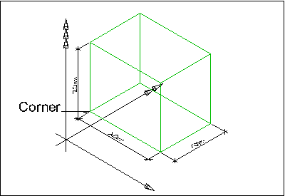
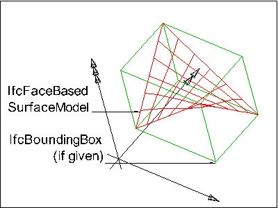

An element is a generalization of all components that make up an AEC product. Those elements can be logically contained by a spatial structure element that constitutes a certain level within a project structure hierarchy (site, building, storey or space). This is done by using the _IfcRelContainedInSpatialStructure_ relationship.

Elements are physically existent objects, although they might be void elements, such as holes. Elements either remain permanently in the AEC product, or only temporarily, as formwork does. Elements can be either assembled on site or pre-manufactured and built in on site.

> EXAMPLE&nbsp; Examples of elements in a building construction context are walls, floors, windows and recesses.

An element can have material and quantity information assigned through the _IfcRelAssociatesMaterial_ and _IfcRelDefinesByProperties_ relationship.

In addition an element can be declared to be a specific occurrence of an element type (and thereby be defined by the element type properties) using the _IfcRelDefinesByType_ relationship.

An element can also be defined as an element assembly that is a group of semantically and topologically related elements that form a higher level part of the AEC product. Those element assemblies are defined by virtue of the _IfcRelAggregates_ relationship.

> EXAMPLE&nbsp; Examples for element assembly are complete Roof Structures, made by several Roof Areas, or a Stair, composed by Flights and Landings.

Elements that performs the same function may be grouped by an "Element Group By Function". It is realized by an instance of _IfcGroup_ with the _ObjectType_ = 'ElementGroupByFunction".

> HISTORY&nbsp; New entity in IFC1.0

{ .use-head}
Quantity Use Definition

The quantities relating to the _IfcElement_ are defined by the _IfcElementQuantity_ and attached by the _IfcRelDefinesByProperties_. A detailed specification for individual quantities is introduced at the level of subtypes of _IfcElement_.

{ .use-head}
Geometry Use Definitions

The geometric representation of any _IfcElement_ is given by the _IfcProductDefinitionShape_ and _IfcLocalPlacement_ allowing multiple geometric representations. A detailed specification for the local placement and shape representaion is introduced at the level of subtypes of _IfcElement_.

___
## Common Use Definitions
The following concepts are inherited at supertypes:

* _IfcRoot_: [Identity](../../templates/identity.htm), [Revision Control](../../templates/revision-control.htm)

[&nbsp;Instance diagram](../../../annex/annex-d/common-use-definitions/ifcelement.htm)

{ .use-head}
Property Sets for Objects

The [Property Sets for Objects](../../templates/property-sets-for-objects.htm) concept applies to this entity as shown in Table 1.

<table>
<tr><td>
<table class="gridtable">
<tr><th><b>PredefinedType</b></th><th><b>Name</b></th></tr>
<tr><td>&nbsp;</td><td><a href="../../psd/ifcsharedfacilitieselements/Pset_Condition.xml">Pset_Condition</a></td></tr>
<tr><td>&nbsp;</td><td><a href="../../psd/ifcproductextension/Pset_EnvironmentalImpactIndicators.xml">Pset_EnvironmentalImpactIndicators</a></td></tr>
<tr><td>&nbsp;</td><td><a href="../../psd/ifcproductextension/Pset_EnvironmentalImpactValues.xml">Pset_EnvironmentalImpactValues</a></td></tr>
<tr><td>&nbsp;</td><td><a href="../../psd/ifcsharedfacilitieselements/Pset_ManufacturerOccurrence.xml">Pset_ManufacturerOccurrence</a></td></tr>
<tr><td>&nbsp;</td><td><a href="../../psd/ifcsharedfacilitieselements/Pset_ManufacturerTypeInformation.xml">Pset_ManufacturerTypeInformation</a></td></tr>
<tr><td>&nbsp;</td><td><a href="../../psd/ifcsharedmgmtelements/Pset_PackingInstructions.xml">Pset_PackingInstructions</a></td></tr>
<tr><td>&nbsp;</td><td><a href="../../psd/ifcsharedfacilitieselements/Pset_ServiceLife.xml">Pset_ServiceLife</a></td></tr>
<tr><td>&nbsp;</td><td><a href="../../psd/ifcsharedfacilitieselements/Pset_Warranty.xml">Pset_Warranty</a></td></tr>
</table>
</td></tr>
<tr><td>
Table 1 &mdash; IfcElement Property Sets for Objects
</td></tr></table>

  
  
{ .use-head}
Product Placement

The [Product Placement](../../templates/product-placement.htm) concept applies to this entity as shown in Table 2.

<table>
<tr><td>
<table class="gridtable">
<tr><th><b>Type</b></th><th><b>Relative</b></th><th><b>Description</b></th></tr>
<tr><td><a href="../../ifcgeometricconstraintresource/lexical/ifclocalplacement.htm">IfcLocalPlacement</a></td><td><a href="../../ifcgeometricconstraintresource/lexical/ifclocalplacement.htm">IfcLocalPlacement</a></td><td>Relative placement according to position and rotation relative to container.</td></tr>
<tr><td><a href="../../ifcgeometricconstraintresource/lexical/ifclocalplacement.htm">IfcLocalPlacement</a></td><td>&nbsp;</td><td>Absolute placement according to position and rotation of world coordinate system.</td></tr>
<tr><td><a href="../../ifcgeometricconstraintresource/lexical/ifcgridplacement.htm">IfcGridPlacement</a></td><td>&nbsp;</td><td>Placement according to grid intersection.</td></tr>
</table>
</td></tr>
<tr><td>
Table 2 &mdash; IfcElement Product Placement
</td></tr></table>

The object placement for any subtype of _IfcElement_ is defined by the _IfcObjectPlacement_, either _IfcLocalPlacement_ or _IfcGridPlacement_, which defines the local object coordinate system that is referenced by all geometric representations of that _IfcElement_.

  
  
{ .use-head}
Box Geometry

The [Box Geometry](../../templates/box-geometry.htm) concept applies to this entity.

&nbsp;

<table>
 <tr>
  <td></td> 
  <td>
<blockquote class="example">EXAMPLE&nbsp; Any <em>IfcElement</em> may be represented by a bounding box, which shows the maximum extend of the body within the object coordinate system established by the <em>IfcObjectPlacement</em>. As shown in Figure 1, the bounding box representation is given by an <em>IfcShapeRepresentation</em> that includes a single item, an <em>IfcBoundingBox</em>.</blockquote>
 </td>
 </tr>
 <tr>
  <td>
Figure 1 &mdash; Building element box representation
</td>
  <td>&nbsp;</td>
 </tr>
</table>

  
  
{ .use-head}
FootPrint Geometry

The [FootPrint Geometry](../../templates/footprint-geometry.htm) concept applies to this entity as shown in Table 3.

<table>
<tr><td>
<table class="gridtable">
<tr><th><b>Identifier</b></th><th><b>Type</b></th><th><b>Items</b></th><th><b>Description</b></th></tr>
<tr><td>FootPrint</td><td>GeometricCurveSet</td><td>&nbsp;</td><td>Any collection of points and curves representing the floor plan projection.</td></tr>
<tr><td>FootPrint</td><td>Annotation2D</td><td>&nbsp;</td><td>Any collection of points and curves, and additional hatching and text representing the floor plan projection.</td></tr>
</table>
</td></tr>
<tr><td>
Table 3 &mdash; IfcElement FootPrint Geometry
</td></tr></table>

  
  
{ .use-head}
Body SurfaceOrSolidModel Geometry

The [Body SurfaceOrSolidModel Geometry](../../templates/body-surfaceorsolidmodel-geometry.htm) concept applies to this entity.

Any _IfcElement_ (so far no further constraints are defined at the level of its subtypes) may be represented as a mixed representation, including surface and solid models.

  
  
{ .use-head}
Body SurfaceModel Geometry

The [Body SurfaceModel Geometry](../../templates/body-surfacemodel-geometry.htm) concept applies to this entity.

Any _IfcElement_ (so far no further constraints are defined at the level of its subtypes) may be represented as a single or multiple surface models, based on either shell or face based surface models. It may also include tessellated models.

&nbsp;

<table>

 <tr>
  
<td></td>

  <td><blockquote class="example">EXAMPLE&nbsp; As shown in Figure 2, the surface model representation is given 
by an <em>IfcShapeRepresentation</em>, which includes a single item which is either an <em>IfcShellBasedSurfaceModel</em>, or an <em>IfcFaceBasedSurfaceModel</em>. In some cases it may also be useful to expose a simple 
representation as a bounding box representation of the same complex 
shape.</blockquote></td>
 </tr>
 
<tr>
  
<td>

Figure 2 &mdash; Element surface model
representation

</td>
  <td>&nbsp;</td>
 
</tr>

</table>

  
  
{ .use-head}
Body Tessellation Geometry

The [Body Tessellation Geometry](../../templates/body-tessellation-geometry.htm) concept applies to this entity.

Any _IfcElement_ (so far no further constraints are defined at the level of its subtypes) may be represented as a single or multiple tessellated surface models, in particular triangulated surface models.

  
  
{ .use-head}
Body Brep Geometry

The [Body Brep Geometry](../../templates/body-brep-geometry.htm) concept applies to this entity.

Any _IfcElement_ (so far no further constraints are defined at the level of its subtypes) may be represented as a single or multiple Boundary Representation models (which are restricted to be faceted Brep's with or without voids). The Brep representation allows for the representation of complex element shape.

&nbsp;

<table>
 
<tr>
  
<td></td>

  <td><blockquote class="example">EXAMPLE&nbsp; As shown in Figure 3, the Brep representation is given by an
 <em>IfcShapeRepresentation</em>, which includes one or more 
items, all of type <em>IfcFacetedBrep</em>. In some cases it may be useful to also expose a simple 
representation as a bounding box representation of the same complex 
shape.</blockquote> </td>
 </tr>

 <tr>
  
<td>

Figure 3 &mdash; Building element body boundary
representation

</td>
  <td>&nbsp;</td>
 </tr>

</table>

  
  
{ .use-head}
Body AdvancedBrep Geometry

The [Body AdvancedBrep Geometry](../../templates/body-advancedbrep-geometry.htm) concept applies to this entity.

An _IfcElement_ (so far no further constraints are defined at the level of its subtypes or by view definitions) may be represented as a single or multiple boundary representation models, which include advanced surfaces, usually refered to as NURBS surfaces. The 'AdvancedBrep' representation allows for the representation of complex free-form element shape.

> NOTE&nbsp; View definitions or implementer agreements may restrict or disallow the use of 'AdvancedBrep' geometry.

  
  
{ .use-head}
Body CSG Geometry

The [Body CSG Geometry](../../templates/body-csg-geometry.htm) concept applies to this entity.

Any _IfcElement_ (so far no further constraints are defined at the level of its subtypes) may be represented a CSG primitive or CSG tree. The CSG representation allows for the representation of complex element shape.

> NOTE&nbsp; View definitions or implementer agreements may restrict or disallow the use of 'CSG' geometry.

  
  
{ .use-head}
Mapped Geometry

The [Mapped Geometry](../../templates/mapped-geometry.htm) concept applies to this entity.

Any _IfcElement_ (so far no further constraints are defined at the level of its subtypes) may be represented using the 'MappedRepresentation'. This shall be supported as it allows for reusing the geometry definition of a type at all occurrences of the same type. The results are more compact data sets.

The same constraints, as given for 'SurfaceOrSolidModel', 'SurfaceModel', 'Tessellation', 'Brep', and 'AdvancedBrep' geometric representation, shall apply to the _IfcRepresentationMap_.