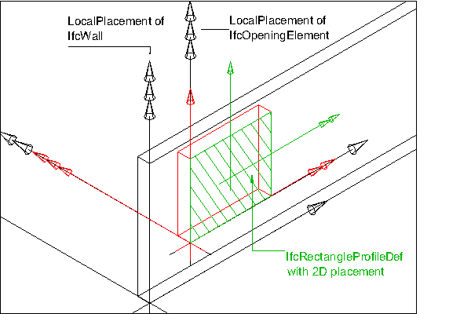
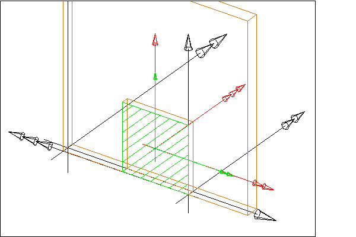
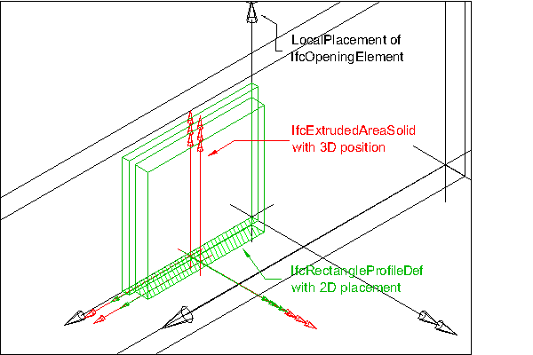

The opening element stands for opening, recess or chase, all reflecting voids. It represents a void within any element that has physical manifestation. Openings can be inserted into walls, slabs, beams, columns, or other elements.

The IFC specification provides two entities for opening elements:

* _IfcOpeningStandardCase_ is used for all openings that have a constant profile along a linear extrusion. They are placed relative to the voided elements and the extrusion direction is perpendicular to the plane of the element (horizontally for walls, vertically for slabs). Only a single extrusion body is allowed. It cuts through the whole thickness of the voided element, i.e. it reflects a true opening.
* _IfcOpeningElement_ is used for all other occurrences of openings and in particular also for niches or recesses.

> NOTE&nbsp; View definitions or implementer agreements may restrict the types of elements which can be voided by an _IfcOpeningElement_ or _IfcOpeningStandardCase_

There are two different types of opening elements:

* an opening, where the thickness of the opening is greater or equal to the thickness of the element;
* a recess or niche, where the thickness of the recess is smaller than the thickness of the element.

The attribute _PredefinedType_ should be used to capture the differences,

* the attribute is set to OPENING for an opening or
* the attribute is set to RECESS for a recess or niche.
* If the value for _PredefinedType_ is omitted, or the value is set to NOTDEFINED, no specific information of whether it is an opening or recess shall be assumed.

An _IfcOpeningElement_ has to be inserted into an _IfcElement_ by using the _IfcRelVoidsElement_ relationship. The relationship implies a Boolean subtraction operation between the volume of the voided element and the volume of the opening. It may be filled by an _IfcDoor_, _IfcWind_ow, or another filling element by using the relationship _IfcRelFillsElements_.

> HISTORY&nbsp; New entity in IFC1.0

{ .change-ifc2x}
> IFC2x CHANGE&nbsp; The intermediate ABSTRACT supertypes _IfcFeatureElement_ and _IfcFeatureSubtraction_ have been added.

{ .change-ifc2x4}
> IFC4 CHANGE&nbsp; The attribute _PredefinedType_ has been added at the end of attribute list. It should be used instead of the inherited attribute _ObjectType_ from now on.

{ .use-head}
Containment Use Definition

The _IfcOpeningElement_ shall not participate in the containment relationship, i.e. it is not linked directly to the spatial structure of the project. It has a mandatory _VoidsElements_ inverse relationship pointing to the _IfcElement_ that is contained in the spatial structure.

* The inverse relationship _ContainedInStructure_ shall be NIL.

> NOTE&nbsp; See _IfcRelVoidsElement_ for a diagram on how to apply spatial containment and the voiding relationship.

___
## Common Use Definitions
The following concepts are inherited at supertypes:

* _IfcRoot_: [Identity](../../templates/identity.htm), [Revision Control](../../templates/revision-control.htm)
* _IfcElement_: [Box Geometry](../../templates/box-geometry.htm), [FootPrint Geometry](../../templates/footprint-geometry.htm), [Body SurfaceOrSolidModel Geometry](../../templates/body-surfaceorsolidmodel-geometry.htm), [Body SurfaceModel Geometry](../../templates/body-surfacemodel-geometry.htm), [Body Tessellation Geometry](../../templates/body-tessellation-geometry.htm), [Body Brep Geometry](../../templates/body-brep-geometry.htm), [Body AdvancedBrep Geometry](../../templates/body-advancedbrep-geometry.htm), [Body CSG Geometry](../../templates/body-csg-geometry.htm), [Mapped Geometry](../../templates/mapped-geometry.htm)
* _IfcFeatureElement_: [Spatial Containment](../../templates/spatial-containment.htm)

[&nbsp;Instance diagram](../../../annex/annex-d/common-use-definitions/ifcopeningelement.htm)

{ .use-head}
Property Sets for Objects

The [Property Sets for Objects](../../templates/property-sets-for-objects.htm) concept applies to this entity as shown in Table 1.

<table>
<tr><td>
<table class="gridtable">
<tr><th><b>PredefinedType</b></th><th><b>Name</b></th></tr>
<tr><td>&nbsp;</td><td><a href="../../psd/ifcproductextension/Pset_OpeningElementCommon.xml">Pset_OpeningElementCommon</a></td></tr>
<tr><td>&nbsp;</td><td><a href="../../psd/ifcsharedfacilitieselements/Pset_Condition.xml">Pset_Condition</a></td></tr>
<tr><td>&nbsp;</td><td><a href="../../psd/ifcproductextension/Pset_EnvironmentalImpactIndicators.xml">Pset_EnvironmentalImpactIndicators</a></td></tr>
<tr><td>&nbsp;</td><td><a href="../../psd/ifcproductextension/Pset_EnvironmentalImpactValues.xml">Pset_EnvironmentalImpactValues</a></td></tr>
<tr><td>&nbsp;</td><td><a href="../../psd/ifcsharedfacilitieselements/Pset_ManufacturerOccurrence.xml">Pset_ManufacturerOccurrence</a></td></tr>
<tr><td>&nbsp;</td><td><a href="../../psd/ifcsharedfacilitieselements/Pset_ManufacturerTypeInformation.xml">Pset_ManufacturerTypeInformation</a></td></tr>
<tr><td>&nbsp;</td><td><a href="../../psd/ifcsharedmgmtelements/Pset_PackingInstructions.xml">Pset_PackingInstructions</a></td></tr>
<tr><td>&nbsp;</td><td><a href="../../psd/ifcsharedfacilitieselements/Pset_ServiceLife.xml">Pset_ServiceLife</a></td></tr>
<tr><td>&nbsp;</td><td><a href="../../psd/ifcsharedfacilitieselements/Pset_Warranty.xml">Pset_Warranty</a></td></tr>
</table>
</td></tr>
<tr><td>
Table 1 &mdash; IfcOpeningElement Property Sets for Objects
</td></tr></table>

  
  
{ .use-head}
Quantity Sets

The [Quantity Sets](../../templates/quantity-sets.htm) concept applies to this entity as shown in Table 2.

<table>
<tr><td>
<table class="gridtable">
<tr><th><b>Name</b></th></tr>
<tr><td><a href="../../qto/ifcproductextension/Qto_OpeningElementBaseQuantities.xml">Qto_OpeningElementBaseQuantities</a></td></tr>
</table>
</td></tr>
<tr><td>
Table 2 &mdash; IfcOpeningElement Quantity Sets
</td></tr></table>

  
  
{ .use-head}
Element Filling

The [Element Filling](../../templates/element-filling.htm) concept applies to this entity.

  
  
{ .use-head}
Product Placement

The [Product Placement](../../templates/product-placement.htm) concept applies to this entity as shown in Table 3.

<table>
<tr><td>
<table class="gridtable">
<tr><th><b>Type</b></th><th><b>Relative</b></th><th><b>Description</b></th></tr>
<tr><td><a href="../../ifcgeometricconstraintresource/lexical/ifclocalplacement.htm">IfcLocalPlacement</a></td><td><a href="../../ifcgeometricconstraintresource/lexical/ifclocalplacement.htm">IfcLocalPlacement</a></td><td>Relative placement according to position and rotation relative to container.</td></tr>
<tr><td><a href="../../ifcgeometricconstraintresource/lexical/ifclocalplacement.htm">IfcLocalPlacement</a></td><td>&nbsp;</td><td>Absolute placement according to position and rotation of world coordinate system.</td></tr>
<tr><td><a href="../../ifcgeometricconstraintresource/lexical/ifcgridplacement.htm">IfcGridPlacement</a></td><td>&nbsp;</td><td>Placement according to grid intersection.</td></tr>
</table>
</td></tr>
<tr><td>
Table 3 &mdash; IfcOpeningElement Product Placement
</td></tr></table>

The local placement for _IfcOpeningElement_ is defined in its supertype _IfcProduct_. It is defined by the _IfcLocalPlacement_, which defines the local coordinate system that is referenced by all geometric representations.

* The _PlacementRelTo_ relationship of _IfcLocalPlacement_ should point to the local placement of the same element, which is voided by the opening, i.e. referred to by _VoidsElement.RelatingBuildingElement_.

  
  
{ .use-head}
Body Geometry

The [Body Geometry](../../templates/body-geometry.htm) concept applies to this entity as shown in Table 4.

<table>
<tr><td>
<table class="gridtable">
<tr><th><b>Identifier</b></th><th><b>Type</b></th><th><b>Items</b></th></tr>
<tr><td>&nbsp;</td><td>&nbsp;</td><td>&nbsp;</td></tr>
</table>
</td></tr>
<tr><td>
Table 4 &mdash; IfcOpeningElement Body Geometry
</td></tr></table>

Currently, the 'Body', and 'Box' representations are supported. The 'Box' representation includes the representation type 'BoundingBox' and is explained at _IfcFeatureElement_.

The 'Body' representation of _IfcOpeningElement_ can be represented using the representation types 'SweptSolid', and 'Brep'. The representation type 'Brep' is explained at _IfcFeatureElement_

_Swept Solid Representation Type with Horizontal
Extrusion_

The 'SweptSolid' geometric representation of _IfcOpeningElement_, using horizontal extrusion direction (for walls), is defined using the swept area solid geometry. The following attribute values for the _IfcShapeRepresentation_ holding this geometric representation shall be used:

* _RepresentationIdentifier_ : 'Body'
* _RepresentationType_ : 'SweptSolid'

The following additional constraints apply to the swept solid representation:

* **Solid**: _IfcExtrudedAreaSolid_ is required, the set of _IfcShapeRepresentation.Items_ may include a single, or multiple, instances of _IfcExtrudedAreaSolid_.
* **Profile**: _IfcRectangleProfileDef_, _IfcCircleProfileDef_ and _IfcArbitraryClosedProfileDef_ shall be supported.
* **Extrusion**: The profile shall be extruded horizontally (perpendicular to the extrusion direction of the voided element such as for wall openings), or vertically (in the extrusion direction of the voided element such as for for floor openings). If multiple instances of _IfcExtrudedAreaSolid_ are used, the extrusion direction of each extrusion should be equal.

> NOTE&nbsp; In case of non-parallel jambs, the shape representation shall be a 'SweptSolid' representation with vertical extrusion.

Figure 1 illustrates an opening with horizontal extrusion.

> NOTE&nbsp; The local placement directions for the _IfcOpeningElement_ are only given as an example, other directions are valid as well.

Figure 2 illustrates an opening for a recess.

> NOTE&nbsp; The local placement directions for the _IfcOpeningElement_ are only given as an example, other directions are valid as well.

> NOTE&nbsp; Rectangles are now defined centric, the placement location has to be set:

* _IfcCartesianPoint_(XDim/2,YDim/2)

_Swept Solid Representation with Vertical Extrusion_

The 'SweptSolid' geometric representation of _IfcOpeningElement_, using vertical extrusion direction (for walls), is defined using the swept area solid geometry, however the extrusion direction may be vertical, i.e. in case of a wall opening, the extrusion would be in the direction of the wall height. The following attribute values for the _IfcShapeRepresentation_ holding this geometric representation shall be used:

* _RepresentationIdentifier_ : 'Body'
* _RepresentationType_ : 'SweptSolid'

The following additional constraints apply to the swept solid representation:

* **Solid**: _IfcExtrudedAreaSolid_ is required, the set of _IfcShapeRepresentation.Items_ may include a single, or multiple, instances of _IfcExtrudedAreaSolid_.
* **Profile**: _IfcRectangleProfileDef_, _IfcCircleProfileDef_ and _IfcArbitraryClosedProfileDef_ shall be supported.
* **Extrusion**: The profile shall be extruded vertically, i.e. for wall openings along the extrusion direction of the voided element.  If multiple instances of _IfcExtrudedAreaSolid_ are used, the extrusion direction should be equal.

Vertical extrusions shall be used when an opening or recess has a non rectangular foot print geometry that does not change along the height of the opening or recess.

Figure 3 shows a vertical extrusion with multiple extrusion bodies for the opening. Each extrusion body has a different extrusion lenght.

> NOTE&nbsp; The local placement directions for the _IfcOpeningElement_ are only given as an example, other directions are valid as well.

