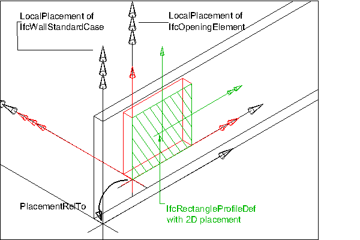

The standard opening, _IfcOpeningStandardCase_, defines an opening with certain constraints for the dimension parameters, position within the voided element, and with certain constraints for the geometric representation. The _IfcOpeningStandardCase_ handles all cases of openings, that:

* are true openings by cutting through the body of the voided element, that is, where the opening depth is greather than or equal to the thickness of the element,
* are extruded perpendicular to the wall plane in case of openings in a wall
* are extruded perpendicular to the slab plane in case of openings in a slab
* have a local placement relative to the local placement of the voided element
* have a 'Body' shape representation with 'SweptSolid' representation type
* have only a single extrusion body within the 'Body' shape representation

> HISTORY&nbsp; New entity in IFC4

___
## Common Use Definitions
The following concepts are inherited at supertypes:

* _IfcRoot_: [Identity](../../templates/identity.htm), [Revision Control](../../templates/revision-control.htm)
* _IfcElement_: [Box Geometry](../../templates/box-geometry.htm), [FootPrint Geometry](../../templates/footprint-geometry.htm), [Body SurfaceOrSolidModel Geometry](../../templates/body-surfaceorsolidmodel-geometry.htm), [Body SurfaceModel Geometry](../../templates/body-surfacemodel-geometry.htm), [Body Tessellation Geometry](../../templates/body-tessellation-geometry.htm), [Body Brep Geometry](../../templates/body-brep-geometry.htm), [Body AdvancedBrep Geometry](../../templates/body-advancedbrep-geometry.htm), [Body CSG Geometry](../../templates/body-csg-geometry.htm), [Mapped Geometry](../../templates/mapped-geometry.htm)
* _IfcFeatureElement_: [Spatial Containment](../../templates/spatial-containment.htm)
* _IfcOpeningElement_: [Property Sets for Objects](../../templates/property-sets-for-objects.htm), [Quantity Sets](../../templates/quantity-sets.htm), [Element Filling](../../templates/element-filling.htm)

[&nbsp;Instance diagram](../../../annex/annex-d/common-use-definitions/ifcopeningstandardcase.htm)

{ .use-head}
Product Placement

The [Product Placement](../../templates/product-placement.htm) concept applies to this entity as shown in Table 1.

<table>
<tr><td>
<table class="gridtable">
<tr><th><b>Type</b></th><th><b>Relative</b></th><th><b>Description</b></th></tr>
<tr><td><a href="../../ifcgeometricconstraintresource/lexical/ifclocalplacement.htm">IfcLocalPlacement</a></td><td><a href="../../ifcgeometricconstraintresource/lexical/ifclocalplacement.htm">IfcLocalPlacement</a></td><td>Relative placement according to position and rotation relative to container.</td></tr>
<tr><td><a href="../../ifcgeometricconstraintresource/lexical/ifclocalplacement.htm">IfcLocalPlacement</a></td><td>&nbsp;</td><td>Absolute placement according to position and rotation of world coordinate system.</td></tr>
<tr><td><a href="../../ifcgeometricconstraintresource/lexical/ifcgridplacement.htm">IfcGridPlacement</a></td><td>&nbsp;</td><td>Placement according to grid intersection.</td></tr>
</table>
</td></tr>
<tr><td>
Table 1 &mdash; IfcOpeningStandardCase Product Placement
</td></tr></table>

The following constraint is mandatory for _IfcOpeningStandardCase_

* The _PlacementRelTo_ relationship of _IfcLocalPlacement_ should point to the local placement of the same element, which is voided by the opening, i.e. referred to by _VoidsElement.RelatingBuildingElement_.

  
  
{ .use-head}
Body Geometry

The [Body Geometry](../../templates/body-geometry.htm) concept applies to this entity as shown in Table 2.

<table>
<tr><td>
<table class="gridtable">
<tr><th><b>Identifier</b></th><th><b>Type</b></th><th><b>Items</b></th></tr>
<tr><td>&nbsp;</td><td>&nbsp;</td><td>&nbsp;</td></tr>
</table>
</td></tr>
<tr><td>
Table 2 &mdash; IfcOpeningStandardCase Body Geometry
</td></tr></table>

The geometric representation of _IfcOpeningStandardCase_ is defined using the following multiple shape representations for its definition:

* Body: A SweptSolid representation defining the 3D subtraction shape of the standard opening

**Body Representation**

The body representation of _IfcOpeningStandardCase_ is represented using the representation type 'SweptSolid'.

_Swept Solid Representation Type with Horizontal
Extrusion_

The standard geometric representation of _IfcOpeningStandardCase_ is defined using the 'SweptSolid' representation. The following attribute values for the _IfcShapeRepresentation_ holding this geometric representation shall be used::

* _RepresentationIdentifier_ : 'Body'
* _RepresentationType_ : 'SweptSolid'

The following additional constraints apply to the swept solid representation:

* **Solid**: a single _IfcExtrudedAreaSolid_ is required
* **Profile**: _IfcRectangleProfileDef_, _IfcCircleProfileDef_ and _IfcArbitraryClosedProfileDef_ shall be supported.
* **Extrusion**: The profile shall be extruded horizontally (i.e. perpendicular to the extrusion direction of the voided element) for wall openings, or vertically (i.e. in the extrusion direction of the voided element), for slab openings.

As shown in Figure 36, the orientation of the opening profile that is extruded for the opening body shall guarantee the following interpretation of dimension parameter for rectangular openings:

* _IfcRectangleProfileDef.YDim_ interpreted as opening width
* _IfcRectangleProfileDef.XDim_ interpreted as opening height

