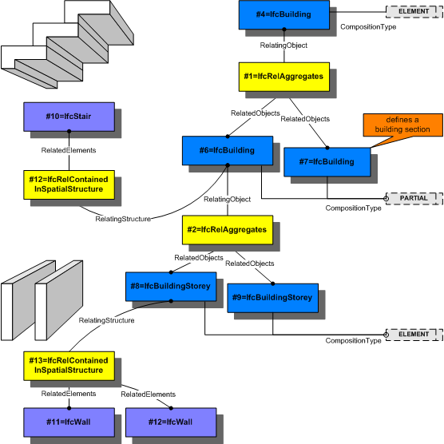

This objectified relationship, _IfcRelContainedInSpatialStructure_, is used to assign elements to a certain level of the spatial project structure. Any element can only be assigned once to a certain level of the spatial structure. The question, which level is relevant for which type of element, can only be answered within the context of a particular project and might vary within the various regions.

> <small>EXAMPLE A multi-storey space is contained (or
        belongs to) the building storey at which its ground level
        is, but it is referenced by all the other building
        storeys, in which it spans. A lift shaft might be
        contained by the basement, but referenced by all storeys,
        through which it spans.</small>
> 

The containment relationship of an element within a spatial structure has to be a hierarchical relationship, an element can only be contained within a single spatial structure element. The reference relationship between an element and the spatial structure may not be hierarchical, i.e. an element can reference many spatial structure elements.

> <small>NOTE The reference relationship is expressed by
        <i>IfcRelReferencedInSpatialStructure</i>.</small>
> 

Predefined spatial structure elements to which elements can be assigned are

* site as _IfcSite_ 
* building as _IfcBuilding_ 
* storey as _IfcBuildingStorey_ 
* space as _IfcSpace_ 

Occurrences of the same element type can be assigned to different spatial structure elements depending on the context of the occurrence.

> EXAMPLE A wall might be normally assigned
        to a storey, however the curtain wall might be assigned
        to the building and the retaining wall in the terrain
        might be assigned to the site.
> 

> <small>HISTORY New entity in IFC
        Release 2x.</small>
> 

> IFC2x PLATFORM CHANGE: The
      data type of the attribute <i>RelatedElements</i> has been
      changed from <i>IfcElement</i> to its supertype
      <i>IfcProduct</i> with upward compatibility for file based
      exchange.

****Containment Use Definition****:

