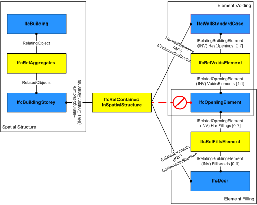

_IfcRelFillsElement_ is an objectified relationship between an opening element and an element that fills (or partially fills) the opening element. It is an one-to-one relationship.

> NOTE&nbsp; View definitions or implementer agreements may restrict an opening to be filled by one filling element only.

> HISTORY&nbsp; New entity in IFC1.0

As shown in Figure 1, the insertion of a door into a wall is represented by two separate relationships. First the door opening is created within the wall by _IfcWall(StandardCase) o-- IfcRelVoidsElement --o IfcOpeningElement_, then the door is inserted within the opening by _IfcOpeningElement o-- IfcRelFillsElement --o IfcDoor_.

