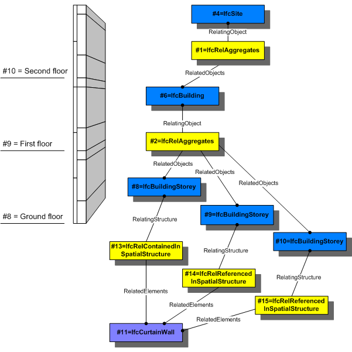

The objectified relationship, _IfcRelReferencedInSpatialStructure_ is used to assign elements in addition to those levels of the project spatial structure, in which they are referenced, but not primarily contained.

> NOTE&nbsp; The primary containment relationship between an element and the spatial structure is handled by _IfcRelContainsInSpatialStructure_.

Any element can be referenced to zero, one or several levels of the spatial structure. Whereas the _IfcRelContainsInSpatialStructure_ relationship is required to be hierarchical (an element can only be contained in exactly one spatial structure element), the _IfcRelReferencedInSpatialStructure_ is not restricted to be hierarchical.

> EXAMPLE&nbsp; A wall might be normally contained within a storey, and since it does not span through several stories, it is not referenced in any additional storey. However a curtain wall might span through several stories, in this case it can be contained within the ground floor, but it would be referenced by all additional stories, it spans.

Predefined spatial structure elements to which elements can be assigned are

* site as _IfcSite_ 
* building as _IfcBuilding_ 
* storey as _IfcBuildingStorey_ 
* space as _IfcSpace_ 

Elements can also be references in a spatial zone that is provided as _IfcSpatialZone_.

Figure 1 shows the use of _IfcRelContainedInSpatialStructure_ and _IfcRelReferencedInSpatialStructure_ to assign an _IfcCurtainWall_ to two different levels within the spatial structure. It is primarily contained within the ground floor, and additionally referenced within the first and second floor.

<table cellpadding="2" cellspacing="2" width="80%">
      <tbody>
        <tr valign="top">
          <td align="left" valign="top"> 
          </td>
        </tr>
        <tr>
          <td>
Figure 1 &mdash; Relationship for spatial structure referencing
</td>
        </tr>
      </tbody>
    </table>

> HISTORY&nbsp; New entity in IFC2x3.
