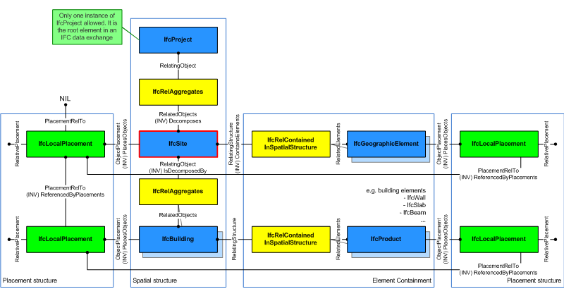
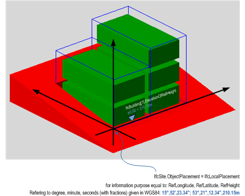
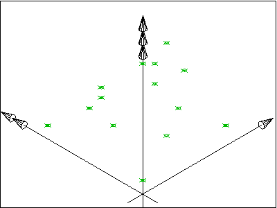
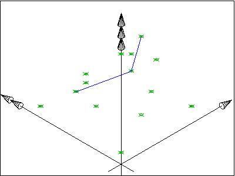
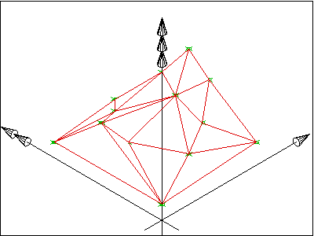

A site is a defined area of land, possibly covered with water, on which the project construction is to be completed. A site may be used to erect, retrofit or turn down building(s), or for other construction related developments.

> NOTE&nbsp; Term according to ISO6707-1 vocabulary "area of land or water where construction work or other development is undertaken".

A site may include a definition of the single geographic reference point for this site (global position using WGS84 with _Longitude_, _Latitude_ and _Elevation_). The precision is provided up to millionth of a second and it provides an absolute placement in relation to the real world as used in exchange with geospational information systems. If asserted, the _Longitude_, _Latitude_ and _Elevation_ establish the point in WGS84 where the point 0.,0.,0. of the _LocalPlacement_ of _IfcSite_ is situated.

The geometrical placement of the site, defined by the _IfcLocalPlacement_, shall be always relative to the spatial structure element, in which this site is included, or absolute, i.e. to the world coordinate system, as established by the geometric representation context of the project. The world coordinate system, established at the _IfcProject.RepresentationContexts_, may include a definition of the true north within the XY plane of the world coordinate system, if provided, it can be obtained at _IfcGeometricRepresentationContext.TrueNorth_.

A project may span over several connected or disconnected sites. Therefore site complex provides for a collection of sites included in a project. A site can also be decomposed in parts, where each part defines a site section. This is defined by the composition type attribute of the supertype _IfcSpatialStructureElements_ which is interpreted as follow:

* COMPLEX = site complex
* ELEMENT = site
* PARTIAL = site section

The _IfcSite_ is used to build the spatial structure of a building (that serves as the primary project breakdown and is required to be hierarchical).

Figure 1 shows the _IfcSite_ as part of the spatial structure. In addition to the logical spatial structure, also the placement hierarchy is shown. In this example the spatial structure hierarchy and the placement hierarchy are identical.

> NOTE&nbsp; Detailed requirements on mandatory element containment and placement structure relationships are given in view definitions and implementer agreements.

> HISTORY &nbsp;New entity in IFC1.0.

{ .use-head}
Attribute Use Definition

Figure 2 describes the heights and elevations of the _IfcSite_. It is used to provide the geographic longitude, latitude, and height above sea level for the origin of the site. The origin of the site is the local placement.

The provision of longitude, latitude, height at the _IfcSite_ for georeferencing is provided for upward compatibility reasons. It requires a single instance of _IfcSite_ and WGS84 as coordinate reference system.

For exact georeferencing (or referencing to any other geographic coordinate system other than WSG84) the entities _IfcCoordinateReferenceSystem_ and _IfcMapConversion_ have to be used to define an exact mapping of the project engineering coordinate system to the geographic (or map) coordinate system.

<ul>
<li><small>reference height of site is provided by:
<em>IfcSite.RefElevation</em>, it is given according to the height datum used
at this location.</small></li>
<li><small>the reference height of each building situated at the site is given
againt the same height datum used at this location.</small></li>
<li><small>the elevations of each storey belonging to each building are given
as local height relative to the reference height of the building.</small></li>
</ul>
<table border="0" cellpadding="2" cellspacing="2" summary="attribute use">
<tbody>
<tr valign="top">
<td align="left" valign="top">&nbsp;</td>
</tr>
<tr>
<td>

Figure 2 &mdash; Site elevations

</td>
</tr>
</tbody>
</table>

___
## Common Use Definitions
The following concepts are inherited at supertypes:

* _IfcRoot_: [Identity](../../templates/identity.htm), [Revision Control](../../templates/revision-control.htm)

[&nbsp;Instance diagram](../../../annex/annex-d/common-use-definitions/ifcsite.htm)

{ .use-head}
Spatial Decomposition

The [Spatial Decomposition](../../templates/spatial-decomposition.htm) concept applies to this entity.

By using the inverse relationship _IfcSite.Decomposes_ it references _IfcProject_ || _IfcSite_ through _IfcRelAggregates.RelatingObject_, If it refers to another instance of _IfcSite_, the referenced _IfcSite_ needs to have a different and higher _CompositionType_, i.e. COMPLEX (if the other _IfcSite_ has ELEMENT), or ELEMENT (if the other _IfcSite_ has PARTIAL).

  
  
{ .use-head}
Spatial Composition

The [Spatial Composition](../../templates/spatial-composition.htm) concept applies to this entity.

By using the inverse relationship _IfcSite.IsDecomposedBy_ it references (em>IfcSite || _IfcBuilding_ || _IfcSpace_ by _IfcRelAggregates.RelatedObjects_. If it refers to another instance of _IfcSite_, the referenced _IfcSite_ needs to have a different and lower _CompositionType_, i.e. ELEMENT (if the other _IfcSite_ has COMPLEX), or PARTIAL (if the other _IfcSite_ has ELEMENT).

  
  
{ .use-head}
Spatial Container

The [Spatial Container](../../templates/spatial-container.htm) concept applies to this entity.

If there are building elements and/or other elements directly related to the _IfcSite_ (like a fence, or a shear wall), they are associated with the _IfcSite_ by using the objectified relationship _IfcRelContainedInSpatialStructure_. The _IfcIfcSite_ references them by its inverse relationship:

* _IfcSite.ContainsElements_ -- referencing any subtype of _IfcProduct_ (with the exception of other spatial structure element) by _IfcRelContainedInSpatialStructure.RelatedElements_

  
  
{ .use-head}
Property Sets for Objects

The [Property Sets for Objects](../../templates/property-sets-for-objects.htm) concept applies to this entity as shown in Table 1.

<table>
<tr><td>
<table class="gridtable">
<tr><th><b>PredefinedType</b></th><th><b>Name</b></th></tr>
<tr><td>&nbsp;</td><td><a href="../../psd/ifcproductextension/Pset_LandRegistration.xml">Pset_LandRegistration</a></td></tr>
<tr><td>&nbsp;</td><td><a href="../../psd/ifcproductextension/Pset_SiteCommon.xml">Pset_SiteCommon</a></td></tr>
<tr><td>&nbsp;</td><td><a href="../../psd/ifcsharedfacilitieselements/Pset_PropertyAgreement.xml">Pset_PropertyAgreement</a></td></tr>
<tr><td>&nbsp;</td><td><a href="../../psd/ifcsharedbldgserviceelements/Pset_AirSideSystemInformation.xml">Pset_AirSideSystemInformation</a></td></tr>
<tr><td>&nbsp;</td><td><a href="../../psd/ifcproductextension/Pset_SpaceFireSafetyRequirements.xml">Pset_SpaceFireSafetyRequirements</a></td></tr>
<tr><td>&nbsp;</td><td><a href="../../psd/ifcproductextension/Pset_SpaceLightingRequirements.xml">Pset_SpaceLightingRequirements</a></td></tr>
<tr><td>&nbsp;</td><td><a href="../../psd/ifcproductextension/Pset_SpaceOccupancyRequirements.xml">Pset_SpaceOccupancyRequirements</a></td></tr>
<tr><td>&nbsp;</td><td><a href="../../psd/ifcproductextension/Pset_SpaceThermalRequirements.xml">Pset_SpaceThermalRequirements</a></td></tr>
<tr><td>&nbsp;</td><td><a href="../../psd/ifcsharedbldgserviceelements/Pset_ThermalLoadAggregate.xml">Pset_ThermalLoadAggregate</a></td></tr>
<tr><td>&nbsp;</td><td><a href="../../psd/ifcsharedbldgserviceelements/Pset_ThermalLoadDesignCriteria.xml">Pset_ThermalLoadDesignCriteria</a></td></tr>
</table>
</td></tr>
<tr><td>
Table 1 &mdash; IfcSite Property Sets for Objects
</td></tr></table>

  
  
{ .use-head}
Quantity Sets

The [Quantity Sets](../../templates/quantity-sets.htm) concept applies to this entity as shown in Table 2.

<table>
<tr><td>
<table class="gridtable">
<tr><th><b>Name</b></th></tr>
<tr><td><a href="../../qto/ifcproductextension/Qto_SiteBaseQuantities.xml">Qto_SiteBaseQuantities</a></td></tr>
</table>
</td></tr>
<tr><td>
Table 2 &mdash; IfcSite Quantity Sets
</td></tr></table>

  
  
{ .use-head}
Product Placement

The [Product Placement](../../templates/product-placement.htm) concept applies to this entity.

The local placement for _IfcSite_ is defined in its supertype _IfcProduct_. It is defined by the _IfcLocalPlacement_, which defines the local coordinate system that is referenced by all geometric representations.

* The _PlacementRelTo_ relationship of _IfcLocalPlacement_ shall point to the _IfcSpatialStructureElement_ of type "_IfcSite_", if relative placement is used (e.g. to position a site relative a a site complex, or a site section to a site).
* If the relative placement is not used, the absolute placement is defined within the world coordinate system. If there is only one site object, then this is the default situation.

  
  
{ .use-head}
FootPrint GeomSet Geometry

The [FootPrint GeomSet Geometry](../../templates/footprint-geomset-geometry.htm) concept applies to this entity as shown in Table 3.

<table>
<tr><td>
<table class="gridtable">
<tr><th><b>Identifier</b></th><th><b>Type</b></th><th><b>Items</b></th><th><b>Description</b></th></tr>
<tr><td>FootPrint</td><td>GeometricCurveSet</td><td><a href="../../ifcgeometricmodelresource/lexical/ifcgeometriccurveset.htm">IfcGeometricCurveSet</a></td><td>Set of curves (outer and inner) representing the floor projection,</td></tr>
</table>
</td></tr>
<tr><td>
Table 3 &mdash; IfcSite FootPrint GeomSet Geometry
</td></tr></table>

The foot print representation of _IfcSite_ is given by either a single 2D curve (such as _IfcPolyline_ or _IfcCompositeCurve_), or by a list of 2D curves (in case of inner boundaries).

  
  
{ .use-head}
Survey Points Geometry

The [Survey Points Geometry](../../templates/survey-points-geometry.htm) concept applies to this entity as shown in Table 4.

<table>
<tr><td>
<table class="gridtable">
<tr><th><b>Identifier</b></th><th><b>Type</b></th><th><b>Items</b></th></tr>
<tr><td>&nbsp;</td><td>&nbsp;</td><td>&nbsp;</td></tr>
</table>
</td></tr>
<tr><td>
Table 4 &mdash; IfcSite Survey Points Geometry
</td></tr></table>

The survey point representation of _IfcSite_ is defined using a set of survey points and optionally breaklines. The breaklines are restricted to only connect points given in the set of survey points. Breaklines, if given, are used to constrain the triangulation.

The representation identifier and type of this geometric representation of _IfcSite_ is:

* _IfcShapeRepresentation.RepresentationIdentifier_ = 'SurveyPoints'
* _IfcShapeRepresentation.RepresentationType_ = 'GeometricCurveSet'

Figure 3 shows a set of survey points, given as 3D Cartesian points within the object coordinate system of the site. Figure 4 shows the result after facetation.

The set of _IfcCartesianPoint_ is included in the set of _IfcGeometricCurveSet.Elements_.

<table cellpadding="2" cellspacing="2" summary="survey points representation">
<tr>
<td></td>
<td></td>
</tr>
<tr>
<td width="400">
Figure 3 &mdash; Site survey points
</td>
<td width="400">
Figure 4 &mdash; Site survey points facetation
</td>
</tr>
</table>

Figure 5 shows A set of survey points, given as 3D Cartesian points, and a set of break points, given as a set of lines, connecting some survey points, within the object coordinate system of the site. Figure 6 shows the result after facetation.

The set of _IfcCartesianPoint_ and the set of _IfcPolyline_ are included in the set of _IfcGeometricCurveSet.Elements_.

<table cellpadding="2" cellspacing="2" summary="survey points representation">
<tr>
<td></td>
<td></td>
</tr>
<tr>
<td width="400">
Figure 5 &mdash; Site breaklines
</td>
<td width="400">
Figure 6 &mdash; Site breaklines facetation
</td>
</tr>
</table>

> NOTE&nbsp; The geometric representation of the site has been based on the ARM level description of the site_shape_representation given within the ISO 10303-225 "Building Elements using explicit shape representation".

  
  
{ .use-head}
Body Geometry

The [Body Geometry](../../templates/body-geometry.htm) concept applies to this entity as shown in Table 5.

<table>
<tr><td>
<table class="gridtable">
<tr><th><b>Identifier</b></th><th><b>Type</b></th><th><b>Items</b></th></tr>
<tr><td>&nbsp;</td><td>&nbsp;</td><td>&nbsp;</td></tr>
</table>
</td></tr>
<tr><td>
Table 5 &mdash; IfcSite Body Geometry
</td></tr></table>

The body representation of _IfcSite_ is defined using a solid or surface model. Applicable solids are the _IfcFacetedBrep_ or on the _IfcFacetedBrepWithVoids_, applicable surface models are the _IfcFaceBasedSurfaceModel_ and the _IfcShellBasedSurfaceModel_.

The representation identifier and type of this representation of _IfcSite_ is:

* _IfcShapeRepresentation.RepresentationIdentifier_ = 'Body'
* _IfcShapeRepresentation.RepresentationType_ = 'Brep', or 'SurfaceModel'