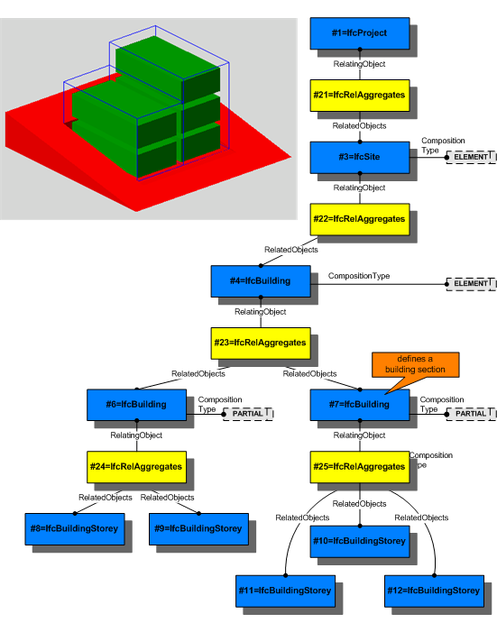

A spatial structure element (_IfcSpatialStructureElement_) is the generalization of all spatial elements that might be used to define a spatial structure. That spatial structure is often used to provide a project structure to organize a building project.

A spatial project structure might define as many levels of decomposition as necessary for the building project. Elements within the spatial project structure are:

* site as _IfcSite_
* building as _IfcBuilding_
* storey as _IfcBuildingStorey_
* space as _IfcSpace_

or aggregations or parts thereof. The composition type declares an element to be either an element itself, or an aggregation (complex) or a decomposition (part). The interpretation of these types is given at each subtype of _IfcSpatialStructureElement_.

The _IfcRelAggregates_ is defined as an 1-to-many relationship and used to establish the relationship between exactly two levels within the spatial project structure. Finally the highest level of the spatial structure is assigned to _IfcProject_ using the _IfcRelAggregates_.

{ .spec-head}
Informal Propositions:

1. The spatial project structure, established by the _IfcRelAggregates_, shall be acyclic.
2. A site should not be (directly or indirectly) associated to a building, storey or space.
3. A building should not be (directly or indirectly) associated to a storey or space.
4. A storey should not be (directly or indirectly) associated to a space.

> HISTORY&nbsp; New entity in IFC2x.

{ .use-head}
Relationship Use Definition

The subtypes of _IfcSpatialStructureElement_ relate to other elements and systems by establishing the following relationships:

<ul>
<li><b>Containment of elements</b> :
<em>IfcRelContainedInSpatialStructure</em> by inverse attribute
<em>ContainsElements</em>, used to assign any element, like
building elements, MEP elements, etc. to the spatial structure
element in which they are primarily contained.
<ul>
<li style="list-style-type=none"><small>NOTE&nbsp; This relationship is
mandatory for elements in several view definitions and
implementer agreements.</small></li>
</ul>
</li>
<li><b>Reference of elements</b> :
<em>IfcRelReferencedInSpatialStructure</em> by inverse attribute
<em>ReferencesElements</em>, used to reference any element, like
building elements, MEP elements, etc. in spatial structure
elements, other then the one, where it is contained.</li>
<li><b>Reference of systems</b> : <em>IfcRelServicesBuildings</em>
by inverse attribute <em>ServicedBySystems</em>, used to reference
a sytem, like a building service or electrical distribution
system, a zonal system, or a structural analysis system, that is
assigned to this spatial structure element.
<ul>
<li style="list-style-type=none"><small>NOTE&nbsp; Elements within the
referenced system may be directly contained (or referenced) by
other spatial structure elements.</small></li>
</ul>
</li>
</ul>
The subtypes of _IfcSpatialStructureElement_ relate to each other by using the _IfcRelAggregates_ relationship to build the project spatial structure.

Figure 1 shows the use of _IfcRelAggregates_ to establish a spatial structure including site, building, building section and storey. More information is provided at the level of the subtypes.

___
## Common Use Definitions
The following concepts are inherited at supertypes:

* _IfcRoot_: [Identity](../../templates/identity.htm), [Revision Control](../../templates/revision-control.htm)
* _IfcSpatialElement_: [FootPrint GeomSet Geometry](../../templates/footprint-geomset-geometry.htm)

[&nbsp;Instance diagram](../../../annex/annex-d/common-use-definitions/ifcspatialstructureelement.htm)

{ .use-head}
Property Sets for Objects

The [Property Sets for Objects](../../templates/property-sets-for-objects.htm) concept applies to this entity as shown in Table 1.

<table>
<tr><td>
<table class="gridtable">
<tr><th><b>PredefinedType</b></th><th><b>Name</b></th></tr>
<tr><td>&nbsp;</td><td><a href="../../psd/ifcsharedfacilitieselements/Pset_PropertyAgreement.xml">Pset_PropertyAgreement</a></td></tr>
<tr><td>&nbsp;</td><td><a href="../../psd/ifcsharedbldgserviceelements/Pset_AirSideSystemInformation.xml">Pset_AirSideSystemInformation</a></td></tr>
<tr><td>&nbsp;</td><td><a href="../../psd/ifcproductextension/Pset_SpaceFireSafetyRequirements.xml">Pset_SpaceFireSafetyRequirements</a></td></tr>
<tr><td>&nbsp;</td><td><a href="../../psd/ifcproductextension/Pset_SpaceLightingRequirements.xml">Pset_SpaceLightingRequirements</a></td></tr>
<tr><td>&nbsp;</td><td><a href="../../psd/ifcproductextension/Pset_SpaceOccupancyRequirements.xml">Pset_SpaceOccupancyRequirements</a></td></tr>
<tr><td>&nbsp;</td><td><a href="../../psd/ifcproductextension/Pset_SpaceThermalRequirements.xml">Pset_SpaceThermalRequirements</a></td></tr>
<tr><td>&nbsp;</td><td><a href="../../psd/ifcsharedbldgserviceelements/Pset_ThermalLoadAggregate.xml">Pset_ThermalLoadAggregate</a></td></tr>
<tr><td>&nbsp;</td><td><a href="../../psd/ifcsharedbldgserviceelements/Pset_ThermalLoadDesignCriteria.xml">Pset_ThermalLoadDesignCriteria</a></td></tr>
</table>
</td></tr>
<tr><td>
Table 1 &mdash; IfcSpatialStructureElement Property Sets for Objects
</td></tr></table>