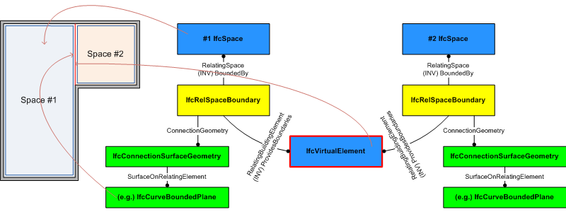

A virtual element is a special element used to provide imaginary boundaries, such as between two adjacent, but not separated, spaces. Virtual elements are usually not displayed and does not have quantities and other measures. Therefore _IfcVirtualElement_ does not have material information and quantities attached.

> NOTE&nbsp; The main purpose of _IfcVirtualElement_ is the provision of a virtual space boundary. The _IfcVirtualElement_ may provide the 2D curve or 3D surface representation of the virtual space connection and is referenced by two instances of _IfcRelSpaceBoundary_, each pointing to one of the two adjacent _IfcSpaces_.

> HISTORY&nbsp; New entity in IFC2x2 Addendum.

{ .change-ifc2x3}
> IFC2x2 CHANGE&nbsp; The entity _IfcVirtualElement_ has been added. Upward compatibility for file based exchange is guaranteed.

{ .use-head}
Space Boundary Use Definition

The _IfcVirtualElement_ is mainly used to define a virtual boundary between two spaces. Figure 1 describes how to use _IfcRelSpaceBoundary_ in conjunction with _IfcVirtualElement_ to define space boundaries.

___
## Common Use Definitions
The following concepts are inherited at supertypes:

* _IfcRoot_: [Identity](../../templates/identity.htm), [Revision Control](../../templates/revision-control.htm)
* _IfcElement_: [Property Sets for Objects](../../templates/property-sets-for-objects.htm), [Product Placement](../../templates/product-placement.htm), [Box Geometry](../../templates/box-geometry.htm), [Body SurfaceOrSolidModel Geometry](../../templates/body-surfaceorsolidmodel-geometry.htm), [Body SurfaceModel Geometry](../../templates/body-surfacemodel-geometry.htm), [Body Tessellation Geometry](../../templates/body-tessellation-geometry.htm), [Body Brep Geometry](../../templates/body-brep-geometry.htm), [Body AdvancedBrep Geometry](../../templates/body-advancedbrep-geometry.htm), [Body CSG Geometry](../../templates/body-csg-geometry.htm), [Mapped Geometry](../../templates/mapped-geometry.htm)

[&nbsp;Instance diagram](../../../annex/annex-d/common-use-definitions/ifcvirtualelement.htm)

{ .use-head}
FootPrint Geometry

The [FootPrint Geometry](../../templates/footprint-geometry.htm) concept applies to this entity as shown in Table 1.

<table>
<tr><td>
<table class="gridtable">
<tr><th><b>Identifier</b></th><th><b>Type</b></th><th><b>Items</b></th><th><b>Description</b></th></tr>
<tr><td>FootPrint</td><td>GeometricCurveSet</td><td>&nbsp;</td><td>Any collection of points and curves representing the floor plan projection.</td></tr>
<tr><td>FootPrint</td><td>Annotation2D</td><td>&nbsp;</td><td>Any collection of points and curves, and additional hatching and text representing the floor plan projection.</td></tr>
</table>
</td></tr>
<tr><td>
Table 1 &mdash; IfcVirtualElement FootPrint Geometry
</td></tr></table>

  
  
{ .use-head}
Surface Geometry

The [Surface Geometry](../../templates/surface-geometry.htm) concept applies to this entity.

The 3D geometric representation of _IfcVirtualElement_ is d efined using a surface geometry. The following constraints apply to the 3D surface representation:

<ul>
 
<li>'Surface3D': <em>IfcSurfaceOfLinearExtrusion</em>,
<em>IfcCurveBoundedPlane</em>, <em>IfcCurveBoundedSurface</em>,
<em>IfcRectangularTrimmedSurface</em></li>

 <li style="list-style-type: none;"><small>in case of an
<em>IfcSurfaceOfLinearExtrusion</em></small>

  <ul>
   
<li><small><u>Profile</u>:
<em>IfcArbitraryOpenProfileDef</em></small></li>
   
<li><small><u>Extrusion</u>: The extrusion direction shall be
vertically, i.e., along the positive Z Axis of the co-ordinate
system of the containing spatial structure element.</small></li>
  
</ul>

 </li>

 <li style="list-style-type: none;"><small>in case of an
<em>IfcCurveBoundedPlane</em>, <em>IfcCurveBoundedSurface</em>,
<em>IfcRectangularTrimmedSurface</em></small>
  
<ul>
   
<li><small><u>Extrusion</u>: The <em>BasisSurface</em> shall be a
surface that is upright, i.e. standing perpendicular to the xy
place of the co-ordinate system of the containing spatial
structure element.</small></li>

   </ul>

 </li>
 
<li>'GeometricSet': a list of 3D surfaces within the constraints
shown above.</li>

</ul>