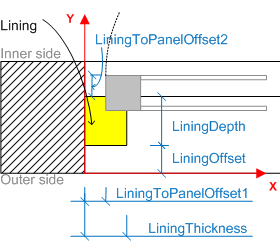
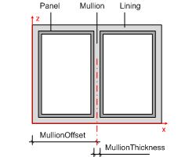
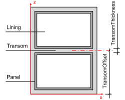
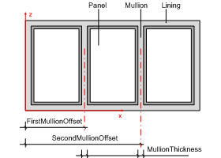
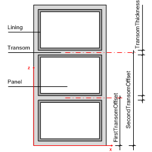

The window lining is the outer frame which enables the window to be fixed in position. The window lining is used to hold the window panels or other casements. The parameter of the _IfcWindowLiningProperties_ define the geometrically relevant parameter of the lining.

> NOTE&nbsp; The _IfcWindowLiningProperties_ shall only be applied to construct the 3D shape of a window, if the attribute _IfcWindowStyle.ParameterTakesPrecedence_ is set TRUE.

The _IfcWindowLiningProperties_ are included in the set of properties of _IfcWindowStyle.HasPropertySets_. More information about the window lining can be included in the same set of the _IfcWindowStyle_ using another _IfcPropertySet_ for dynamic extensions.

> HISTORY&nbsp; New entity in IFC2.0. Has been renamed from _IfcWindowLining_ in IFC2x.

{ .change-ifc2x4}
> IFC4 CHANGE&nbsp; The following attributes have been added _LiningOffset_, _LiningToPanelOffsetX_, _LiningToPanelOffsetY_. The attribute _ShapeAspectStyle_ is deprecated and shall no longer be used. Supertype changed to new _IfcPreDefinedPropertySet_.

{ .use-head}
Geometry use definitions

The _IfcWindowLiningProperties_ does not hold a geometric representation. However it defines parameters which can be used to create the shape of the window style (which is inserted by the _IfcWindow_ into the spatial context of the project) as shown in Figure 1.

The parameters at the _IfcWindowLiningProperties_ define a standard window lining, including (if given) a mullion and a transom (for horizontal and vertical splits). The outer boundary of the lining is determined by the occurrence parameter assigned to the _IfcWindow_, which inserts the _IfcWindowStyle_.

<table>
 <tr>
  <td>
   <table border="1" cellpadding="2" cellspacing="2">
    <tr>
     <td></td>
     <td valign="top" align="left">
The lining is applied to all faces of the opening reveal. The parameter are:

      <ul>
       <li><em>LiningDepth</em></li>
       <li><em>LiningThickness</em></li>
       <li><em>LiningOffset</em></li>
       <li><em>LiningToPanelOffsetX</em></li>
       <li><em>LiningToPanelOffsetY</em></li>
      </ul>
      <blockquote class="note">NOTE&nbsp; Parameters <em>LiningOffset</em>, <em>LiningToPanelOffsetX</em>, <em>LiningToPanelOffsetY</em> added in IFC4.
      </blockquote>
      
The inner side is defined as the direction of the window panel opening operation.

     </td>
    </tr>
    <tr>
     <td></td>
     <td valign="top" align="left">
      
If the <i>OperationType</i> of the window style is

      <ul>
       <li>DoublePanelVertical (shown)</li>
       <li>TriplePanelBottom</li>
       <li>TriplePanelTop</li>
       <li>TriplePanelLeft</li>
       <li>TriplePanelRight</li>
      </ul>
      
the following additional parameter apply:

      <ul>
       <li><i>MullionThickness</i></li>
       <li><i>FirstMullionOffset</i> - measured as offset to the Z axis (in XZ plane)</li>
      </ul>
     </td>
    </tr>
    <tr>
     <td></td>
     <td valign="top" align="left">
      
If the <i>OperationType</i> of the window style is

      <ul>
       <li>DoublePanelHorizontal</li>
       <li>TriplePanelBottom</li>
       <li>TriplePanelTop</li>
       <li>TriplePanelLeft</li>
       <li>TriplePanelRight</li>
      </ul>
      
the following additional parameter apply

      <ul>
       <li><i>TransomThickness</i></li>
       <li><i>FirstTransomOffset</i> measured as offset to the X axis (in XZ plane)</li>
      </ul>
     </td>
    </tr>
    <tr>
     <td></td>
     <td valign="top" align="left">
      
If the <i>OperationType</i> of the window style is

      <ul>
       <li><i>TriplePanelVertical</i></li>
      </ul>
      
the following additional parameter apply

      <ul>
       <li><i>SecondMullionOffset</i></li>
      </ul>
     </td>
    </tr>
    <tr>
     <td></td>
     <td valign="top" align="left">
      
If the <i>OperationType</i> of the window style is

      <ul>
       <li><i>TriplePanelHorizontal</i></li>
      </ul>
      
the following additional parameter apply

      <ul>
       <li><i>SecondTransomOffset</i></li>
      </ul>
     </td>
    </tr>
   </table>
  </td>
 </tr>
 <tr>
  <td>
Figure 1 &mdash; Window lining properties
</td>
 </tr>
</table>

NOTE

1. All offsets are given as a normalized ratio measure.