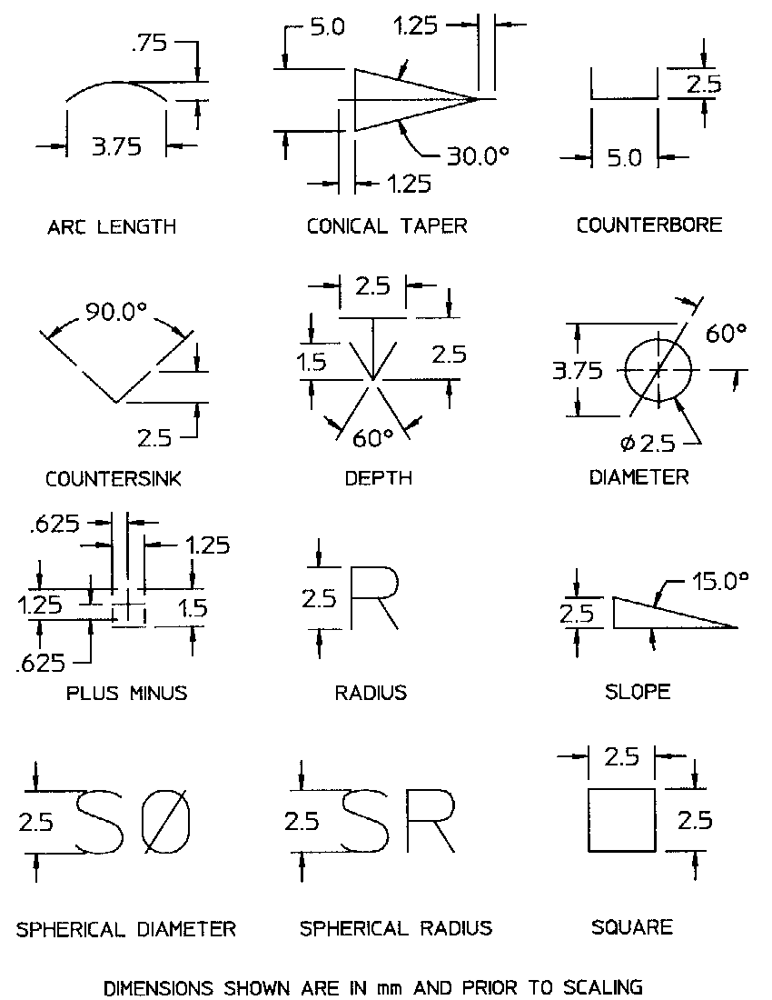

The pre defined dimension symbol is a pre defined symbol for the purpose to identify a dimension symbol by name. Allowable names are:

* 'arc length',
* 'conical taper',
* 'counterbore', 
*  'countersink',
* 'depth',
* 'diameter',
* 'plus minus', 
*  'slope',
* 'spherical diameter',
* 'spherical radius',
* 'square'

> NOTE: The <i>IfcPreDefinedDimensionSymbol</i> is an
		  entity that had been adopted from ISO 10303, Industrial automation systems and
		  integration&#151;Product data representation and exchange, Part 202:
		  Application protocol: Associative draughting.
>

>  NOTE Corresponding STEP name:
		  pre_defined_dimension_symbol. Please refer to ISO/IS 10303-202:1994 page 201
		  for the final definition of the formal standard. 
> 
> HISTORY New entity in Release
		  IFC2x 2nd Edition. 
>

**Illustration from ISO 10303-202, page 203**:

