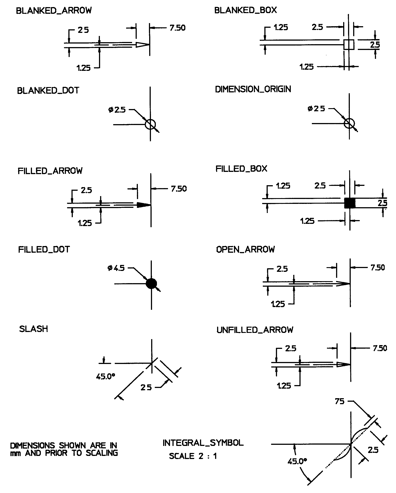

The pre defined terminator symbol is a pre defined symbol for the purpose to identify a terminator by name. Allowable names are:

* 'blanked arrow',
* 'blanked box',
* 'blanked dot', 
*  'dimension origin',
* 'filled arrow',
* 'filled box',
* 'filled dot', 
*  'integral symbol',
* 'open arrow',
* 'slash',
* 'unfilled arrow'

> NOTE: The <i>IfcPreDefinedTerminatorSymbol</i> is an
		  entity that had been adopted from ISO 10303, Industrial automation systems and
		  integration&#151;Product data representation and exchange, Part 202:
		  Application protocol: Associative draughting.
>

>  NOTE Corresponding STEP name:
		  pre_defined_terminator_symbol. Please refer to ISO/IS 10303-202:1994 page 209
		  for the final definition of the formal standard. 
> 
> HISTORY New entity in Release
		  IFC2x 2nd Edition. 
>

**Illustration from ISO 10303-202, page 212**:

