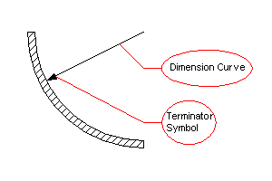

The radial dimension is a draughting callout that presents the radial length of a conic element. It consists of a dimension curve and may have projection curves (but is often defined without projection curves).

> NOTE: The dimension text is handled through the
		  <i>IfcStructuredDimensionCallout</i> and associated via the
		  <i>IfcDimensionCalloutRelationship</i>.
>

**Illustration**:

> NOTE: The <i>IfcRadiusDimension</i> is an entity that
		  had been adopted from ISO 10303, Industrial automation systems and
		  integration&#151;Product data representation and exchange, Part 202:
		  Application protocol: Associative draughting.
>

>  NOTE Corresponding STEP name:
		  radius_dimension. Please refer to ISO/IS 10303-202:1994 for the final
		  definition of the formal standard. 
> 
> HISTORY New entity in Release
		  IFC2x 2nd Edition. 
>