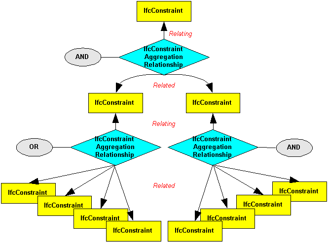

An _IfcConstraintAggregationRelationship_ is an objectified relationship that enables instances of _IfcConstraint_ and its subtypes to be aggregated together logically.

> HISTORY: New Entity in IFC Release
		  2.0. Modified in IFC 2x2
>

### Use Definition
The _IfcConstraintAggregationRelationship_ allows the aggregation link between constraints to be logically defined (AND, OR). In this way, where an object or property has multiple constraints assigned, the linkage between them can be specified. Thus linked constraints might show as (&gt; X AND &lt; Y) which is useful for an allowed range or bounded value or as (A OR B OR C) which is valuable for an enumerated property where a selection is constrained to be one of A, B or C.

